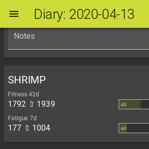
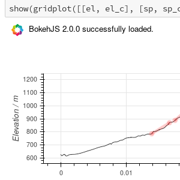
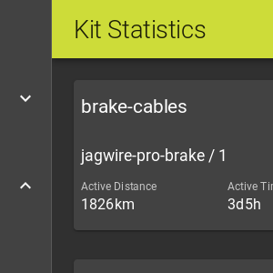
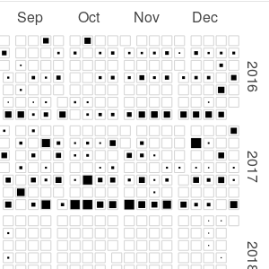
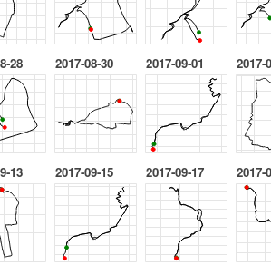

# Choochoo (ch2)

An **open**, **hackable** and **free** training diary.

Originally I hoped that anyone could run this code by installing a Python
package.  When it became clear that was too complex and error-prone I moved to
a Docker image.  However, the Docker approach is also complex (and growing in
complexity - currently it requires three Docker images running in parallel) so
I am now looking at web hosting (for paid use to cover costs).

At the same time I need to add more features for my own use.  This will likely
include starting to use PostGIS (now easier with the use of Docker).

As a consequence of all this I am putting less effort into [install and
startup instructions](https://andrewcooke.github.io/choochoo/).  So for a time
(until plans change or I get web hosting working) this project will be more
difficult to use.  I'm sorry about this, but it's clearly not sustainable in
its current form.  Hopefully it will continue to evolve until it reaches a
more useful state.

