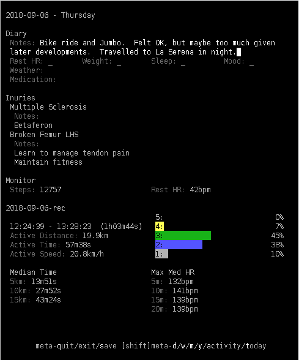
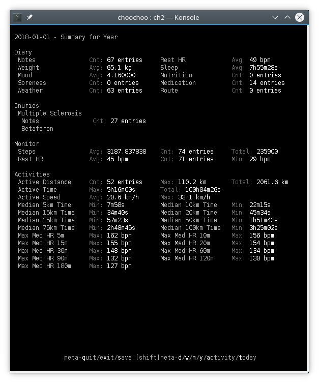
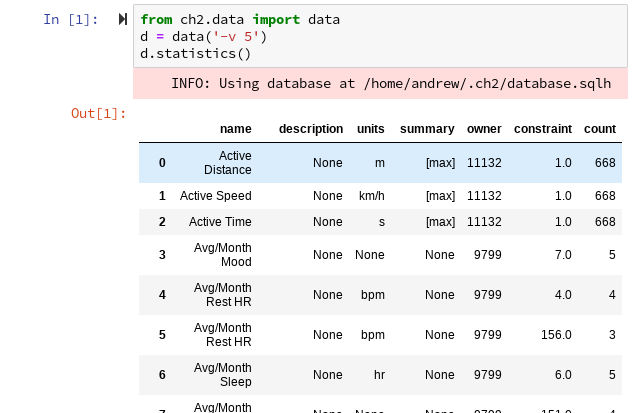
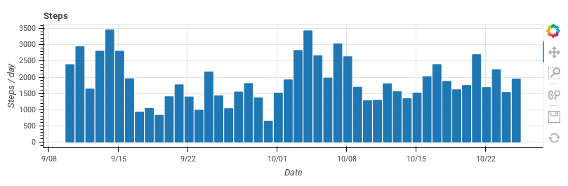

# choochoo (ch2)

An **open**, **hackable** and **free** training diary.

See [documentation](https://andrewcooke.github.io/choochoo/) for full
details.

* [Screenshots](#screenshots)
* [Technical Overview](#technical-overview)
* [Latest Changes](#latest-changes)

## Screenshots

### Diary

### Data

### Plots

## Technical Overview

All data are stored in an SQLite database (SQLAlchemy ORM interface).
The schema separates "statistics" (named time series data) from the
source (which might be direct entry, read from a FIT file, or
calculated from pre-existing values).

The "diary" view, where the user enters data, is itself generated from
the database.  So the fields displayed (and the statistics collected)
can be customized.  This configuration can include "schedules" which
control when information is displayed (eg: weekdays only; every other
day; second sunday in the month).

The combination of customizable diary fields and scheduling allows
training plans to be entered and displayed.

Customization (fields, training plans, etc) must be done via Python or
SQL.  There is no graphical user interface.  This presents a steep
learning curve but is ultimately very flexible - "any" training plan
can be accomodated.

Data are processed via "pipelines".  These are Python classes whose
class names are also configured in the database.  Existing pipelines
calculate statistics from FIT file data and summaries based on
existing data and schedules (eg monthly averages).

A Python interface allows data to be extracted as DataFrames for
analysis in Jupyter workbooks.  So general Python data science tools
(Pandas, Numpy, etc) can be used to analyse the data.  Example
workbooks are included in the source.

The data are in an "open" format, directly accessible by third party
tools, and easily backed-up (eg by copying the database file).  When
the database format changes scripts are provided to migrate existing
data (see package `ch2.migraine`).

*Choochoo collects and organises time-series data using
athlete-appropriate interfaces.  It facilitates calculations of
derived statistics and extraction of data for further analysis using
Python's rich data science ability.*

## Latest Changes

### v0.3.0

Diary now uses dates (rather than datetimes) and is timezone aware
(Previously all times were UTC datetimes; now data related to the
diary - like statistics calculated on daily intervals - use the date
and the local timezone to convert to time.  So, for example, stats
based on monitor data are from your local "day" (midnight to
midnight)).

Monitor data from FIT files can be imported.

### v0.2.0

Major rewrite to generalize the database schema.  Moved a lot of
configuration into the database.  Now much more flexible, but less
interactive.
