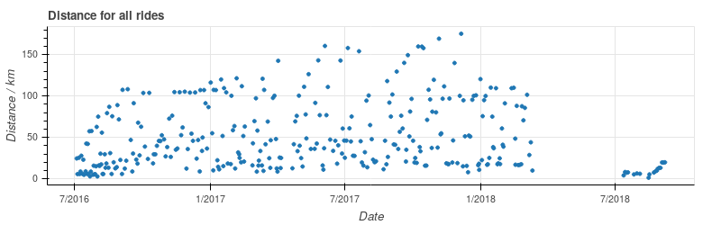
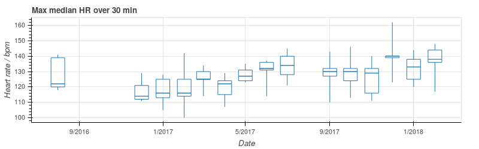

# Analysis

## Introduction

This documentation focuses on simple, direct (but also limited) data access 
via [pandas](https://pandas.pydata.org/) and [Jupyter](http://jupyter.org/) - 
this will let you read, manipulate and plot data within your web browser.

Plotting packages in Python - especially for maps - seem to be unreliable,
so the emphasis here is on providing the data in an agnostic way.  Hopefully
you can then display that data with whatever you find works for you.
Current examples use [Bokeh](https://bokeh.pydata.org/) and
[Matplotlib](https://matplotlib.org/).

All Choochoo's data (all *your* data) are stored in an SQLite3 file at 
`~/.ch2/database.sql?` (the final character changes with database
schema version).  So you can also use any programming language with an 
SQLite binding (for Python the `ch2.squeal.tables` package contains a
[SQLAchemy](https://www.sqlalchemy.org/) ORM mapping).

## Contents

* [Starting Jupyter](starting-jupyter)
* [Accessing Data](accessing-data)
* [Plotting Data](plotting-data)
* [Examples](examples)

## Starting Jupyter

We use Jupyter as the environment, because it's pretty and little extra work
over pure python.  All that is necessary, assuming that Choochoo is installed,
is typing

    jupyter notebook
    
which should display a window in your web browser.  There you can load the
examples from `ch2/data/notebooks`.

## Accessing Data

Data are accessed via the `ch2.data.data()` function, which returns a
`ch2.data.database.Data` instance.

For example, in a new Python 3 notebook:

    from ch2.data import data
    d = data('-v 0')
    d.statistics()

will show a list of the statistics available.

You may want to revise the [data model](data-model) at this point.

The `ch2.data.database.Data` instance provides access to:

* **Statistics** - a list of all the available Statistics (ie a
  description of what data are available).

      d.statistics('%HR%')

* **Statistic Journals** - time series values for particular
  Statistics (ie the data themselves).

      d.statistic_journals('Rest HR')

  Since Statistic names are not unique these can be qualified by the
  `owner` aond `constraint` values that are provided by
  `Data.statistics()`.

* **Activities** - a list of all the Activities (ie activity *types* -
  eg Bike, Run, etc).

      d.activities()

* **Activity Journals** - entries for the activities themselves.

      d.activity_journals('Bike')

* **Activity Waypoints** - time series associated with a single
  activity.

      d.activity_waypoints('Bike', '2018-02-18 10:26:56')

The various methods above typically take a list of names or SQL
patterns.  The returned DataFrames usually have the date / time
information as index.

## Plotting Data

To see examples of how to plot this data see:

* The Jupyter notebooks in `ch2/data/notebooks` - these use Bokeh.
* The code in `tests/test_data.py` - these use Matplotlib.

A few helper routines are available in `ch2.data.plot` to help massage the
data into the correct format.

## Examples

These are taken from the Jupyter notebooks described above.  Obviously results
depend on the data entered into the system.

