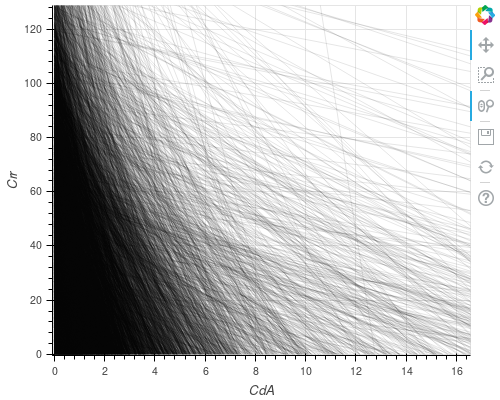
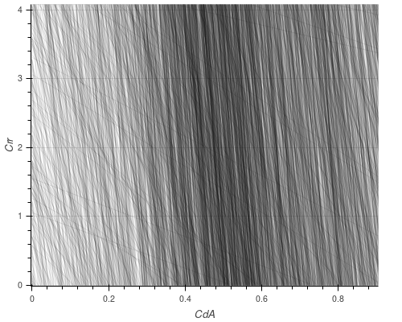
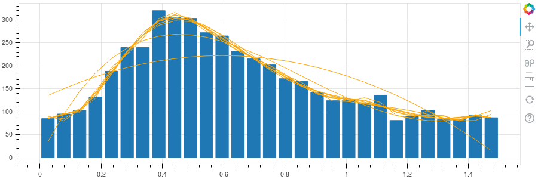
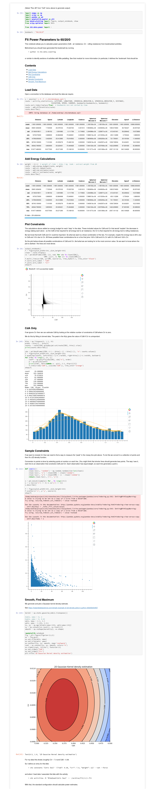

# Measuring Power and CdA

When you're cycling your energy is spent either climbing hills or
pushing air out of the way - those are the two main "sinks" of energy.

The first - climbing hills - is easy to calculate [given elevation
data](elevation).  The second depends on your speed (squared), the
cross-section area you present (`A`), and a constant (`Cd`).  The area
and constant together are known as `CdA`.

Here I measure `CdA` and use it, together with the elevation data, to
estimate power output.

* [Previous Work](#previous-work)
* [A Statistical Approach to CdA](#a-statistical-approach-to-cda)
  * [Physics](#physics)
  * [Coasting](#coasting)
  * [Calculating CdA and Crr](#calculating-cda-and-crr)
  * [Data Exploration](#data-exploration)
  * [Final Measurement](#final-measurement)
* [Power Estimates](#power-estimates)
  * [Calculation](#calculation)
  * [Results](#results)
* [Configuration](#configuration)
  * [Pipeline](#pipeline)
  * [Power.Bike Constant](#powerbike-constant)
  * [Cotic Soul Constant](#cotic-soul-constant)
  * [Configuration Process](#configuration-process)
* [Summary](#summary)
* [Update - Now with Crr](#update---now-with-crr)

## Previous Work

I'm not the first to have thought of this.  [This
document](https://github.com/andrewcooke/choochoo/blob/master/data/dev/indirect-cda.pdf)
describes an approach to measure both `CdA` and `Crr` (rolling
resistance) by making test rides.

## A Statistical Approach to CdA

However, I'm stuck at home injured, so I want to derive `CdA` from
"normal" ride data I already have, without a power meter.

### Physics

The physics is pretty simple.  If we know the bike's height and speed
at two different points, and the distance between them, then:

  * The total energy "added" to the system is the gravitational
    potential energy from a drop in height (going downhill) *plus* any
    extra work done pedaling.

  * The total energy "removed" from the system is via aerodynamic drag
    *plus* braking *plus* rolling resistance.

  * The difference between energy input and output will be seen as a
    difference in speed before and after (kinetic energy), ignoring
    losses due to braking.

That's a fair number of variables, but we can simplify things by:

  * Only using data where the ride is not pedaling (where cadence is
    low).

  * Assuming that there is no wind (which would affect aerodynamic
    drag).

  * Ignoring rolling resistance (which should be relatively small).

  * Treating the braking as "noise".  This will become clearer later,
    but basically we can hope that braking will be seen as erroneous
    measurements that give high `CdA` values.

Another way of saying this is that we will divide the ride into many
small sections.  In some the rider will be braking, and those will
give bad results.  But hopefully there are enough sections without
braking that we can see some kind of consensus emerge.

### Coasting

First, we need to find sections of the ride where the rider is not
pedaling.  For this we need the cadence sensor.

The SQL query
[here](https://github.com/andrewcooke/choochoo/blob/master/ch2/stoats/calculate/cda.py#L39)
is intimidating, but not as complex as it looks.  It is trying to find
start and finish points (`s` and `f`) where:

  * The cadence is less than `max_cadence` at those points and at all
    points between.

  * Outside the two points (at `ss` and `ff`) the cadence is more than
    `max_cadence` (so we have the largest section possible).

  * All points are in the same "timespan" (lap / autopause block).

  * The average speed across the whole segment is at least
    `min_speed`.

  * The total time across the whole segment is at least `min_time`.

Segments found are added to the ActivityBookmark table.

### Calculating CdA and Crr

Once we have found the segments we can look at each "step" (recording
interval) in the segment.  At the start and end of each step we know
the location, distance and speed (`v`), so we can calculate:

  * [Elevation](elevation) change, `h`.

  * The distance traveled, `d`.

  * The gravitational potential energy gained (or lost, if climbing).
    This is `m x g x h` where `m` is mass (rider and bike) and `g` is
    gravitational acceleration (9.8 m/s).

  * The kinetic energy before and after (`1/2 x m x v^2`).

  * The average of the squared speed `avg_v2`, assuming that speed
    varies linearly (constant acceleration).  You need to do a little
    calculus for this, but it turns out that it's `v_a^2 + v_a x v_b +
    v_b^2` where `v_a` is the speed at the start and `v_b` the speed
    at the end.

  * The loss in energy due to air (`CdA x p x avg_v2 x d`) where `p`
    is air density (1.225kh/m^3).

  * The loss in energy due to friction (`Crr x d`).

### Data Exploration

From the energy balance described [above](#physics) we know that the
change in energy can be attributed to resistance from air *plus*
friction.  If we don't know `CdA` or `Crr` then all we have is their
sum.  This means that, for each step we can plot a line on the graph
of `CdA` n `Crr` (the line shows all points that sum to give the same
energy loss).

That plot looks like this:

Zoomed in on the x-axis (`CdA`) we can see:

There's clearly a peak around a value of `CdA` at something like 0.5.
But there's no evidence of any kind of preferred value in the y
direction.

I was hoping (optimistically) that we would see a preference for a
certain value of `Crr` (ie more lines crossing at a certain y value)
because the different dependency on speed for the two coefficients
means that they should be distinguisable in observations made at
different speeds.  But I think here we're just getting too much noise
from braking (which we can't control for, and which appears as rolling
resistance).

### Final Measurement

Given the above, we'll assume `Crr` is zero and calculate `CdA` alone.
This is equivalent to counting the number of lines that cross the x
axis in the plot above.  Viewed as a histogram:

The curves are polynomials fit to the data - a way of smoothing the
data to find the maximum.  From those, the maximum is somewhere around
0.44.

## Power Estimates

### Calculation

Given an estimate of CdA it's then possible, for any segment of a
route, to calculate the overall energy balance.  If we continue to
ignore braking then the sum of any (1) energy gained (indicated by
increased speed or height) and (2) energy lost (via CdA) must be
equal, numerically, to the average power multiplied by the time
interval.

This logic can be seen in the code
[here](https://github.com/andrewcooke/choochoo/blob/master/ch2/stoats/calculate/power.py).
In particular,

    df[POWER] = (df[DELTA_ENERGY] + df[LOSS]) / df[DELTA_TIME]

### Results

The plot above shows a typical example taken from an [activity
report](summary).  Values are calculated using the "natural" sampling
of the GPS file - the energy balance is calculated at each GPS
position.  The results are very noisy (even when, as here, median
smoothed over 60s), but have fairly reasonable values.

Limitations include:

* Braking is ignored and effectively "uses up" some power, leading to
  under-estimates.

* I suspect [elevation](elevation) is over-smoothed, but I am unsure
  how this would affect estimates.

* "Negative" power is simply ignored (after smoothing).

* Wind speed and direction is ignored.

* `Crr` is ignored (and could be significant for MTB on rough ground).

* I have no measured power data to calibrate.

* The current implementation uses "constant" parameters for mass, etc.
  Some of these could be taken from the database itself.

## Configuration

Configuring the power calculation is complex because the calculations
cross-reference values from elsewhere in the database.

### Pipeline

By default the pipeline is configured as:

    > sqlite3 ~/.ch2/database.sqlp "select * from pipeline where cls like '%Power%'"
    7|0|ch2.stoats.calculate.power.PowerStatistics|[]|{"owner": "ActivityImporter", "power": "Power.Bike"}|60

which shows that the `power` variable references the constant `Power.Bike`.

### Power.Bike Constant

    > ch2 constants Power.Bike               

    Power.Bike: Data needed to estimate power - see Power enum                     1970-01-01 00:00:00+00:00: {"bike": "#$ActivityImporter:Bike", "weight": "$Topic:Weight:Topic \"Diary\" (d)", "p": 1.225, "g": 9.8}

The constant referenced above contains the basic data used to
calculate power.  These can be modified using the `ch2 constants`
command.

Two entries are particularly important here:

  * `"weight": "$Topic:Weight:Topic \"Diary\"` - this defines a
    `weight` attribute whose value will be the most recent value of
    the `Weight` statistic (owner `Topic`, constaint `Topic "Diary"`.

    In other words, the `weight` attribute will take the most recent
    weight from the daily diary.

  * `"bike": "#$ActivityImporter:Bike"` - this defines a `bike`
    attribute that is JSON encoded (`#`) reference, named by the
    variable `Bike` (owner `ActivityImporter`, constraint implicitly
    activity group).

    The `Bike` variable is set when the activity is loaded:

        > ch2 activities -D 'Bike=Cotic Soul' ...

    and is itself a constant (see below).

    So this evaluates to the contents of the `Cotic Soul` constant, in
    this particular case (a different bike name would evaluate
    differently).

### Cotic Soul Constant

    > ch2 constants 'Cotic Soul'

    Cotic Soul: [no description]                                                   1970-01-01 00:00:00+00:00: {"cda": 0.44, "crr": 0, "m": 12}

This constant describes a particular bike.  The particular name / bike
used is chosen when the `ch2 activities` command is run, via the
`Bike` variable.

### Configuration Process

  * The pipeline is configured as part of the default configuration.

  * The `Weight` variable in the diary is also part of the default
    configuration.

  * The `Power.Bike` constant is also part of the default configuration,
    but will need to be modified with the correct value for `CdA`.

  * The `Bike` variable is set during activities import.

  * The `Cotic Soul` (or whatever name you use for *your* bike) constant
    must be added by the user:

        python <<EOF
        from ch2.config import *
        from ch2.config.database import add_enum_constant
        from ch2.stoats.calculate.power import Bike

        log, db = config('-v 5')
        with db.session_context() as s:
             add_enum_constant(s, 'Cotic Soul', Bike, constraint='ActivityGroup "Bike"')
        EOF

    and then defined correctly using the `ch2 constants` command.

        dev/ch2 constants --set 'Cotic Soul' '{"cda": 0.44, "crr": 0, "m": 12}'

## Summary

The data suggest that my `CdA` is around 0.44, which appears to be
roughly correct.   With this I can estimate power output.  Again, the
values are ballpark correct.

The code to generate bookmarks is
[here](https://github.com/andrewcooke/choochoo/blob/master/ch2/uranus/coasting.py)
and can be run via:

    > python -m ch2.uranus.coasting

## Update - Now with Crr

[July 2007] - I have extended the notebook I used for the work above
and added it as a template.  If you run:

    > ch2 jupyter show fit_power_parameters 'bookmark'

the Jupyter page should be displayed.  This now fits both CdA and Crr
(despite what I said above!).  For full details (including an
explanation of the 'bookmark'), see the template.

Below is a snaphshot of the template with my data:

