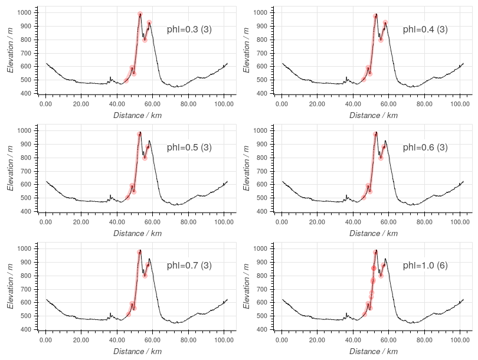
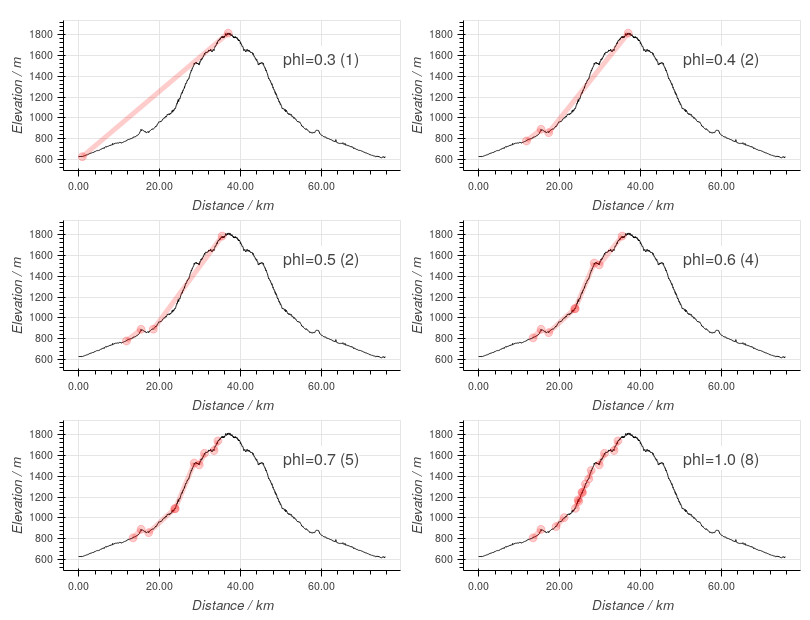
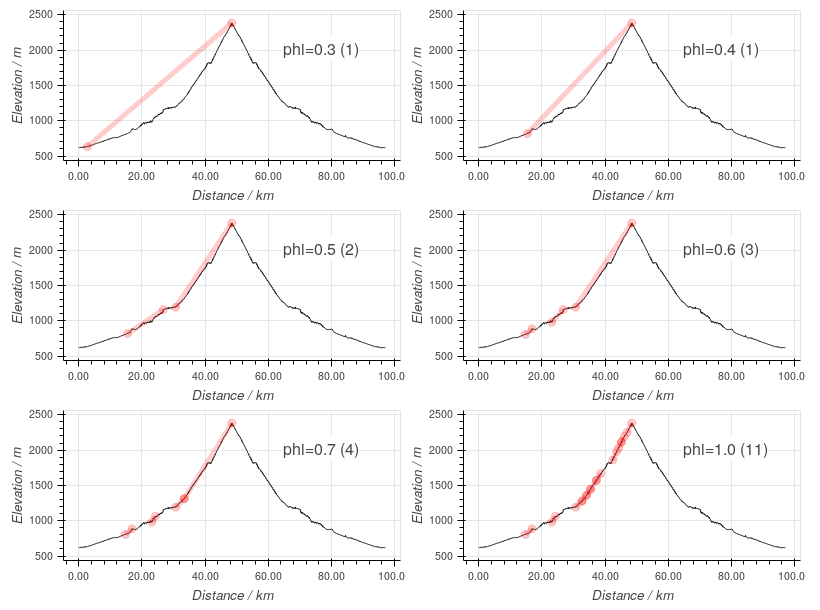

# Climbs

Climbs are an important part of cycling for many people, so Choochoo
should generate suitable statistics.  However, it turns out that this
is a difficult problem because there is no single, clear definition of
a climb.

One approach is to use "the crowd" to identify climbs, as done on
Strava with segments.  However, this has its own problems (variable
quality, inconsistent) and is anyway impractical for Choochoo.

Another approach is to look for "standards" like the classification of
climbs in competitions.  This too has problems, which I will discuss
below.

Choochoo was took a new approach - automatic detection of climbs.
This gives consistent, reliable statistics from "natural" climb
identifications.  Of course, "natural" is open to interpretation;
user-adjustable parameters allow the algorithm to be tweaked if
desired.

  * [Design](#design)
    * [Criteria](#criteria)
    * [Algorithm](#algorithm)
    * [Tuning](#tuning)
    * [Efficiency](#efficiency)
  * [Configuration](#configuration)
  * [Results](#results)

## Design

### Criteria

Strava give a little detail on the catgeories they use
[here](https://support.strava.com/hc/en-us/articles/216917057-Climb-Categorization).
For some weird reason (to confuse?  impress?) they use the product of
grade and distance.  But as described
[here](http://theclimbingcyclist.com/gradients-and-cycling-an-introduction/)
that is equivalent to elevation.

There
[seems](https://www.sportivecyclist.com/strava-mapmyride-cycling-climb-categories/)
to be a miniumum grade of 3%, and the minimum score for categorisation
(8000) implies a minimum gain in elevation of 80m (a 1000m climb at 8%
scores 8000 and climbs 80m, for example).

Unfortunately, minimum grade, minimum elevation gain, and "as much
elevation gain as possible" are not enough to identify hills - a climb
is more than just the largest difference in elevation on a ride.

Instead, we must have some way of "scoring" different climbs that
includes gradient directly.  But gradient, too, is insufficient - a
climb is more than the steepest section of road.

### Algorithm

Some experimentation showed that combinging a greedy search with a way
to "score" climbs gave good results.

The greedy search finds the "best" climb in the data, extracts that,
and then looks at the remaining sections of ride and finds the "best"
climbs there, repeatedly, until the data are exhausted.

To find the "best" climb we need some way to score climbs, based on
the start and end points.  Two candidates were already discussed
above: total elevation gain and gradient.  In practice, it seems that
these are too extreme and we need something "in-between".

Two ways to combine total gain and gradient were tried.  First, a
weighted limear sum.  This was rejected because it was difficult to
adjust (small changes in the weighting gave large changes in results).
Second, and more usefully, the expression

    score = elevation_gain / (distance ** phi)

was used.  When the parameter `phi` is 0 this is simply
`elevation_gain`; when `phi` is 1 the score is `gradient`; when `phi`
is around 0.5 you get a mix of results (see [tuning](#tuning)).

In addition, climbs are checked to see if the contain any descents.
Climbs with a "significant" descent (eg a drop of more than 10% of the
total elevation gain) are split into two (either side of the descent).

### Tuning

The following plots show which climbs are identified on three rides
for various values of `phi`.

As `phi` is increased from 0 to 1 we see a more "adaptive" fitting of
the slope.  There is no one value that is clearly "best", but having
experience of the three routes I felt that a value of 0.6 gave climbs
that most accurately reflected the "different climbs" in the ride.

### Efficiency

Checking each combination of GPS points on a ride to find the "best"
climb is expensive (technically, it is an O(n^2) algorithm).  Luckily
the number of points is such that it is stil feasible (at least for my
rides).  Luckier still, we can reduce time by first finding a rough
solution using every 10th point (say).  This gives a 100x speed-up and
makes the algorithm viable when ingesting large numbers of rides.

## Configuration

The default configuration includes `Climb.Bike` which defines the
parameters used to search for climbs.  These are:

  * **phi** - used to select the scoring model (see [tuning](#tuning)
    above).

  * **min_gradient** - the minimum gradient (in percent) for a climb
    to be considered.

  * **min_elevation** - the minimum elevation gain (in m) for a climbe
    to be considered.

  * **max_reversal** - the fraction amount of elevation gain that can
    be descended with a climb (if this is exceeded then the climb is
    split into two, one either side of the descent).

## Results

Climbs are displayed in the daily diary and on the summary graphics.
