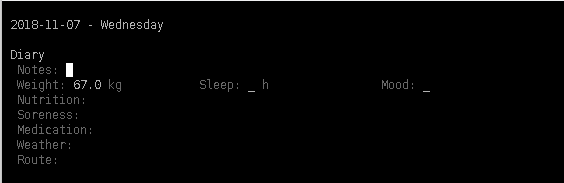

# Configure

Detailed configuration is very powerful, but also complex.  All I can
do here is give some guidelines and examples.  Hopefully as you
explore the system you will understand it better.

Additional statistics can be added after the system is in use.  There
is no need to do all configuration "up front".

  * [Safety First](#safety-first)
    * [Backups](#backups)
    * [SQL Consistency](#sql-consistency)
    * [Best Practice](#best-practice)
  * [Reset](#reset)
  * [Configuring with Python](#configuring-with-python)
    * [Connecting to the Database](#connecting-to-the-database)
    * [The Default Configuration](#the-default-configuration)
      * [Constants](#constants)
      * [Topics and Statistics](#topics-and-statistics)
    * [My Personal Configuration](#my-personal-configuration)
    * [Adding a Field](#adding-a-field)
  * [Configuring with SQL](#configuring-with-sql)

## Safety First

### Backups

All Choochoo's data - both configuration and training statistics - are
stored in a single database file.  The exact name of this file depends
on the program version and is displayed if you run the `ch2` command.

For example:

    > ch2
    INFO: Using database at /home/andrew/.ch2/database.sqlj
    ...

You should make a copy of this file before changing the configuration
so that if you make a mistake you can copy the backup back and return
to your previous state.

### SQL Consistency

When altering the database you should be concerned about consistency -
you do not want to introduce any errors or lose any data.

The database has various rules to help avoid errors but,
unfortunately, these are disabled by default.  So whenever you are
using SQL directly (ie using the `sqlite3` command) enable the rules
with `pragma foreign_keys = on`:

    > sqlite3 /home/andrew/.ch2/database.sqlj
    SQLite version 3.23.1 2018-04-10 17:39:29
    Enter ".help" for usage hints.
    sqlite> pragma foreign_keys = on
    sqlite>

In general, with these rules enabled, adding new information is safe.
Deleting information from the database, however, may delete more than
you intend as the database will delete information to preserve
consistency.  In particular, if you delete a an entry from
`statistic_name` then you will lose all the values associated with
that statistic.

### Best Practice

Putting the two sections above together:
* Make a copy of the database before changing anything
* Enable foreign keys if using `sqlite3` directly.
* After making the changes, run the diary and check things look OK.  If
  not, revert back to the copy you made earlier and try again.

## Reset

If you want to reset your configuration, simply delete the database.
But remember that **this will also delete all your data**.

Changing configuration but keeping data is difficult, but for examples
of how to approach the problem see the migration scripts (used when
the database schema changes) in `ch2.migraine`.

## Configuring with Python

In the examples that follow I will use the Python command line
directly.  Using a script is similar and, because you can delete the
database and re-run the script until debugged, more useful in
practice.

### Connecting to the Database

    > python                               
    Python 3.7.0 (default, Aug 20 2018, 18:32:46)
    [GCC 7.3.1 20180323 [gcc-7-branch revision 258812]] on linux
    Type "help", "copyright", "credits" or "license" for more information.
    >>> from ch2.config import *
    >>> log, db = config('-v 5')
    INFO: Using database at ...
    >>>

The `config()` command above takes command line arguments similar to
`ch2` (space-separated or in separate strings) and returns a log (from
the standard python logging library; more useful in scripts) and a
database connection.

### The Default Configuration

This has the same effect (on an empty database) as the `ch2
default-config` command:

    >>> default(db)
    >>>

In the next few sections I will compare the [source for the
default](https://github.com/andrewcooke/choochoo/blob/master/ch2/config/default.py)
with the results.

#### Constants

    > ch2 constant
    INFO: Using database at ...

    FTHR.Bike: Heart rate at functional threshold (cycling). See https://www.britishcycling.org.uk/knowledge/article/izn20140808-Understanding-Intensity-2--Heart-Rate-0

    FTHR.Run: Heart rate at functional threshold (running).

The command above lists the available constants.  These are values
that you can provide at the command line.  For example:

    > ch2 constant --set FTHR.Bike 154

These constants are defined in the
[source](https://github.com/andrewcooke/choochoo/blob/master/ch2/config/default.py)
with `add_activity_constant()`.  This takes a reference to an
activity, defined with `add_activity()`.  If you are unsure what an
activity is, now is the time to study the [data model](data-model).

#### Topics and Statistics

If we start the diary with the default config

    > ch2 diary

we see something like

These fields correspond to the calls to `add_topic_field()` made near
the bottom of
[default()](https://github.com/andrewcooke/choochoo/blob/master/ch2/config/default.py),

In addition, we can see how these are connected to statistic
definitions in the database:

    > sqlite3 /home/andrew/.ch2/database.sqlj "select * from topic_field join statistic_name on statistic_name_id = statistic_name.id where statistic_name.name == 'Medication'"
    7|1|3|80|9|ch2.uweird.fields.topic.Text|[]|{}||9|Medication|||[cnt]|7403|1

Some of the numerical values may be different, but this shows how the
`topic_field` table refers to `statistic_name`.  If you look at the
definition of `add_topic_field()` in
[ch2.config.database](https://github.com/andrewcooke/choochoo/blob/master/ch2/config/database.py)
you can see the code that does this.

### My Personal Configuration

The code for the configuration that I use (at least, roughly) is
visible
[here](https://github.com/andrewcooke/choochoo/blob/master/ch2/config/personal.py).

### Adding A Field

Here's an example where I add a field to an existing configuration.

First, get an idea of what is already defined:

    > sqlite3 ~/.ch2/database.sqlj 'select * from topic_field join statistic_name on statistic_name_id = statistic_name.id'

Then add the field:

    > python <<EOF
    from ch2.config.database import config, add_topic_field
    from ch2.squeal.tables.topic import Topic
    from ch2.uweird.fields import Text
    log, db = config('-v 5')
    with db.session_context() as s:
        diary = s.query(Topic).filter(Topic.name == 'Diary').one()
        add_topic_field(s, diary, 'Route', 90, display_cls=Text)
    EOF

## Configuring with SQL

Here I swap the `sort` value so that two files are displayed in a
different order.

First, to see how topics and staitsics are associated (so I know which
topic to change for a give statistic ):

    > sqlite3 ~/.ch2/database.sqlj 'select * from topic_field join statistic_name on statistic_name_id = statistic_name.id'

Next, swap the values.

    > sqlite3 ~/.ch2/database.sqlj 'update topic_field set sort=-1 where sort=70'
    > sqlite3 ~/.ch2/database.sqlj 'update topic_field set sort=70 where sort=80'
    > sqlite3 ~/.ch2/database.sqlj 'update topic_field set sort=80 where sort=-1'

