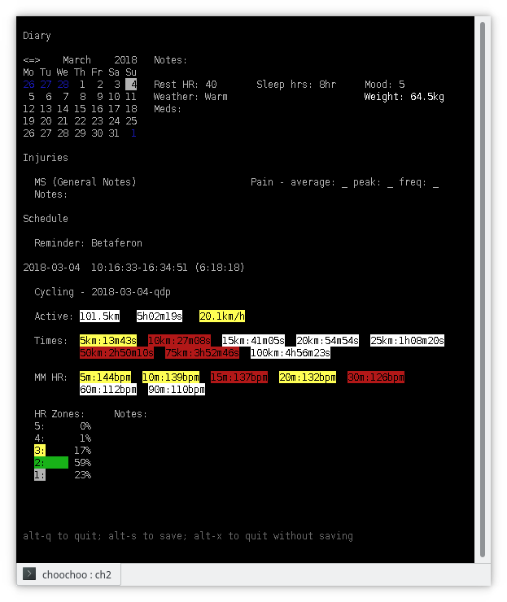
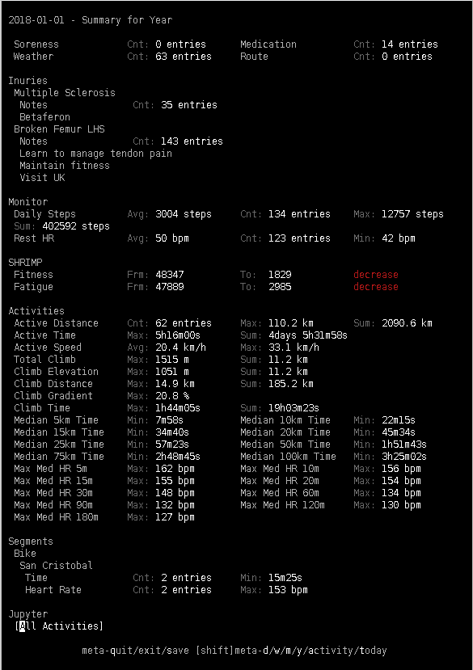

# Daily Use

* [Organisation](#organisation)
* [Diary](#diary)
  * [Daily](#daily)
  * [Re-calculating Statistics](#re-calculating-statistics)
  * [Summaries](#summaries)
* [Monitoring](#monitoring)
  * [Download from Garmin Connect](#download-from-garmin-connect)
  * [Monitor Entry](#monitor-entry)
* [Activities](#activities)
  * [Download from Device](#download-from-device)
  * [Activity Entry](#activity-entry)
  * [FTHR](#fthr)
* [Data Analysis](#data-analysis)

## Organisation

It makes a lot of sense to keep *all* your FIT data on disk somewhere.
If something changes in Choochoo and the database becomes invalid /
needs changing, you can re-load the data rather than trying to port
the old database (you still need to port diary entries, but that is
usually simpler and less volume).

Also, keeping your FIT data means you're not tied to using Choochoo in
the future.

The program has been designed with this in mind - it will re-scan
directories containing FIT data and only processs data that are new.

So before starting choose where you will store FIT data (and maybe
make backup copies of this data on a regular basis, along with the
Choochoo database).

## Diary

### Daily

Starting the diary with

    > ch2 diary

will display the configured topic fields for data entry (for today).
When you are done, type `alt-Q` to save and quit (`alt-X` to quit
without saving).

You can choose alternative dates by specifying a date on the command
line or by `alt-D/W/M/Y` to move (backwards) by a day / week / month /
year.  To move forwards hold down `shift` too.  To move to the last
activity use `alt-A`.  To return to todat, use `alt-T`.

See [configuration](configuration) for how to add additional fields.

Above, a typical diary entry, showing notes and HR zones for an
activity.

Options under the heading "Jupyter" are explained
[below](#data-alanylsis).

### Re-calculating Statistics

Summary statistics (top values per month etc) are calculated when
monitor data and activities are entered (see below).  But these are
automatically erased whenever you enter data (for the appropriate
intervals, because they may no longer be correct).

To re-calculate missing values simply run:

    > ch2 statistics

To re-calculate all statistics (ie delete all existing values first):

    > ch2 statistics --force

### Summaries

To see the monthly and yearly statistics use:

    > ch2 diary --month

    > ch2 diary --year

Above, a yearly summary, showing a severe decline in fitness due to
injury.

## Monitoring

Monitoring refers to "lifestyle" data collected by Garmin (or
compatible) watches.  In particular, heart rate and steps walked are
recorded.

### Download from Garmin Connect

Each morning I upload monitor data to Garmin Connect using the phone
app.  This tells me how many hours I slept, number of steps I walked
previous day, etc.

To get the data into Choochoo we need to download it from Garmin.
There are two ways to do this.

The first time you download data, you probably have a *lot* of data to
download.  So go to
[https://www.garmin.com/en-US/account/datamanagement/](https://www.garmin.com/en-US/account/datamanagement/)
and download all the data.  Unpack this into a suitable directory so
that the FIT files are visible.

Subsequent times you download data, you probably only have a day or
two of data to download.  In that case use the command

    > ch2 garmin --user USER --pass PWD PATH/TO/DIR

to download the latest data.

### Monitor Entry

Once you have downloaded the data it can be read into Choochoo using

    > ch2 monitor PATH/TO/DATA

If you enable multi-directory globbing (`shopt -s globstar` in bash)
then the command might look like:

    > ch2 monitor /archive/**/*.fit

This will load data and re-calculate appropriate statistics.

## Activities

Activities are things like bike rides, runs, etc.  These are grouped
by 'activity groups' which are part of the
[configuration](configuration).

### Download from Device

After an activity I connect my watch to the computer using USB and
download the FIT file with data to disk.

(In future it should also be possible to download from Garmin Connect,
but I haven't needed this yet, so haven't written the code).

Data from previous activities may be avaialble to download in bulk
from Starava, Garmin, etc.

### Activity Entry

Once you have downloaded the data it can be read into Choochoo using

    > ch2 activities PATH/TO/DATA

If you enable multi-directory globbing (`shopt -s globstar` in bash)
then the command might look like:

    > ch2 activities /archive/**/*.fit

This will load data and re-calculate appropriate statistics.

### FTHR

Some of the statistics require heart rate zones.  These are based on
the FTHR which you can define as a contants.

To list all available constants:

    > ch2 constants

For the default configuration this should include `FTHR.Bike` which is
the FTHR used for the `Bike` activity group.

To set a glibal value use:

    > ch2 constants --set FTHR.Bike 154

You can also set a value from a particular date, list and delete
values.  See `ch2 constants -h` and `ch2 help constants` for more
details.

A possible estimator for your FTHR is the "Max med HR 30m" statistic.
This is the maximum value found for the median heart rate over 30
minutes in ride (so the heart rate for the entire ride is median
filtered with a 30 minute window and then the maximum value taken).

## Data Analysis

For full details [go here](data-analysis), but Choochoo includes some
basic data anlysis "built-in":

  * At the bottom of a daily diary page that contains an activity you
    will see a section labelled "Jupyter" with one or two menu
    options.  Use "tab" to navigate to the menu, "left" and "right"
    (arrows / cursor keys) to change, and "return" to select.

  * At the bottom of the monthly / yearly diary page you will see a
    section labelled "Jupyter".  Use "tab" to navigate to the "button"
    and "return" to select.

Selecting will start Jupyter and display a page in the browser.  You
can edit this page and load data while the diary remains running.

An example display for comparing activities is:

