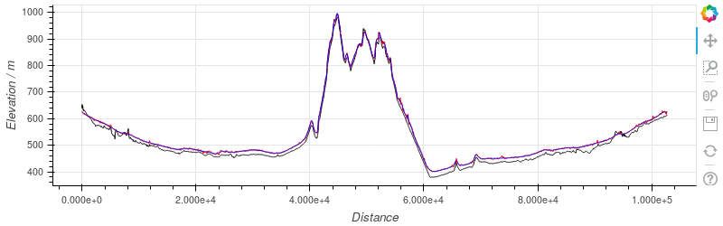
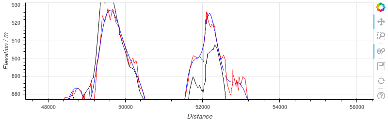

# Elevation

Many devices don't track elevation.  Choochoo can generate elevation
data by cross-referencing the latitude and longitude from the GPS data
against topographic information from NASA.

  * [Design](#design)
  * [Configuration](#configuration)
  * [Results](#results)

## Design

The [Shuttle Radar Tomography Mission
(SRTM)](https://www2.jpl.nasa.gov/srtm/) was a project to measure the
"height" almost everywhere on Earth (except for the polar regions)
using radar carried on the Space Shuttle.

These data have been released to the public.  The "best" and most
recent release (in 2014) is called SRTM 3.0 and has a resolution of 1
arcsecond (approximately 30m on the equator).

Using these data is surprisingly easy.  They are packaged into files
covering a square degree, named after the "bottom left" corner.  So
given a position it is easy to know which file to use.  Within the
file the data are packaed as a simple array.

The only problematic part of the process is that downloading the files
requires registration.  I could not automate this (could not get
OAuth2 to work correctly) so you must download the data you need
manually.  The good news is you likely only need one or two files.

## Configuration

Two things need to be done to get elevation working.

First, you must set the directory where the SRTM files will be stored:

    > ch2 constants --set SRTM1.Dir /PATH/TO/SRTM/DIRECTORY

Second, you must download the appropriate data.  You may be able to
find the correct file(s) [here](http://dwtkns.com/srtm30m/) by using
the map.  Otherwise, simply import activity data and read the error
message when Choochoo fails to find the right file.

Once you have the correct files, re-run import to calculate
elevations:

    > ch2 activities --force /PATH/TO/FIT/FILES

## Results

This plot shows ride elevation with [climbs](climbs) identified.

A section of the same ride as above, showing the SRTM data (black) and
GPS data from a FR230 watch (red).  There's a consistent offset that
is likely due to different geodesics and slightly more noise in the
GPS.  There are also a few systematic differences that I cannot
explain and the *hint* of a delay in the GPS values.

