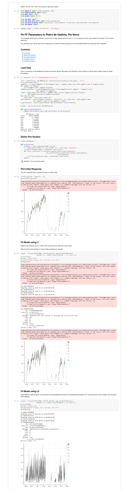

2019-11-05

# Fitting SHRIMP Decay

The decay time in the [SHRIMP](impulse) model may vary by person,
sport, age, etc.  Here I describe a Jupyter template that lets you
measure the parameter using [segment](segments) speeds.

## Contents

  * [Prerequisites](#prerequisites)
  * [Using The Template](#using-the-template)
    * [The Command](#the-command)
    * [Understanding The Results](#understanding-the-results)

## Prerequisites

The [SHRIMP](impulse) model tries to measure 'fitness'.  The following
template assumes that 'fitness' is similar to speed on known
[segments](segments).

So this is only going to work if you (1) define at least one segment
and (2) regularly ride (or run I guess) that segment, as fast as your
are able at that time.

## Using The Template

### The Command

For the segments `Pedro de Valdivia` and `Pio Nono` (for example) use
the command

    > ch2 jupyter show fit_ff_segments 'Pedro de Valdivia' 'Pio Nono'

After running the cells I see:

### Understanding The Results

In the L1 fit the results don't vary much as points are rejected (the
period, in hours, is printed before the message about 'Dropping
value').  Also, the final fit looks in reasonable agreement with the
points.

In the L2 fit, however, the results seem to depend critically on which
points are rejected and the final plot doesn't show a good fit.

The L1 fit is more robust (less sensitive to noise) and appears to
have given useful results - a time period of around 22 days.  This is
significantly shorter than the 'standard' value of 42 days, perhaps
reflecting my age.
