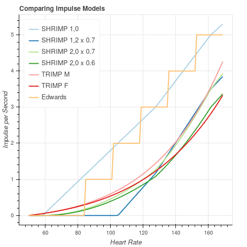
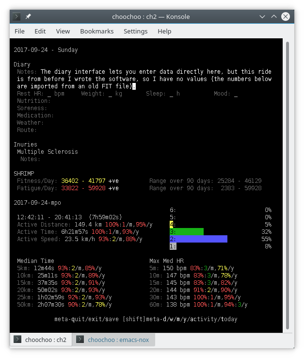
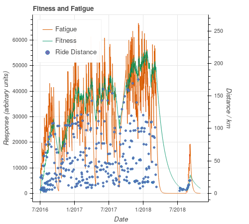

2018-11-25

# Scaled Heart Rate Impulse - SHRIMP (TRIMP, TSS, ...)

I'm writing this article for a couple of reasons.

First, I want to explain and de-mystify the FF-Model (TRIMP, TSS, CTL,
ATL, TSB, etc).  I get the impression many people don't understand
quite how *simple* it all is.  Following from that, maybe people
aren't understanding exactly what it shows, or how it can or should be
used.

Second, I want to showcase Choochoo - a *hackable* training diary.
Choochoo is written for people at the intersection between sport and
computing / maths / science.  People who want to experiment, get their
hands dirty, and build their own, personal, customized approach.

I'm going to show how Choochoo implements the FF-Model.  How the
calculations are made, what they mean, and how they might be tweaked.
I'll end with some questions that people might want to explore -
questions that I hope to explore using this software.

(OK, there's a third reason. SHRIMP.  Cool name, huh?)

## Contents

* [Theory](#theory)
  * [Adding Up Training](#adding-up-training)
  * [Exponential Decay](#exponential-decay)
  * [Fatigue](#fatigue)
  * [Summary](#summary)
  * [Seriously?](#seriously)
* [Survey](#survey)
  * [Academic Literature](#academic-literature)
  * [Popular Literature](#popular-literature)
  * [Software](#software)
    * [Training Peaks](#training-peaks)
    * [Golden Cheetah](#golden-cheetah)
    * [Strava](#strava)
  * [Open Questions](#open-questions)
    * [Arbitrary Form](#arbitrary-form)
    * [Parameter Fitting](#parameter-fitting)
* [This Work](#this-work)
  * [Choochoo](#choochoo)
  * [Impulse Calculation](#impulse-calculation)
  * [Response Calculation](#response-calculation)
  * [Architecture](#architecture)
  * [Results](#results)
* [Discussion](#discussion)
  * [Flexible Impulse](#flexible-impulse)
  * [Training and Measurement](#training-and-measurement)
  * [Multiple Models](#multiple-models)
  * [Heart Rate v Power](#heart-rate-v-power)
  * [Uncertain Science](#uncertain-science)
  * [Future Work](#future-work)
* [Appendix - Getting Started with Choochoo](#appendix---getting-started-with-choochoo)
  * [Install](#install)
  * [Configure](#configure)
  * [Load Data](#load-data)
  * [Plot Data](#plot-data)
  * [Modify Constants](#modify-constants)
  * [Re-calculate](#re-calculate)
* [Appendix - The Author](#appendix---the-author)

## Theory

Imagine it's your job to predict how an athlete gets better or worse
over time.  To model *Fitness*.  What do you do?

You know they get better if they train.  And - within reason - the
more they train the better they get.  So a good first step would be to
add up all the training.

But that's just a number that keeps getting bigger and bigger.  You
need to take into account that people get worse if they *stop*
training.  So why not decrease the number by some fixed amount (10%
say) each day they do nothing?

Congratulations!  You just invented the FF-Model.

All we need to do now is worry about the details...

### Adding Up Training

What, exactly, do we add up?

First, we need to gauge *intensity*, so we need something you can
measure.  Power meters are the obvious example.  But there are other
options, too.  Perceived exertion (ranked on a numeric scale - there
are various standards) is not as sexy, but could work.  Heart rate is
another possibility.

Second, we need to decide on a weighting.  Harder workouts
automatically score more because they are more intense.  But maybe
they should score *extra*?  Maybe there's some threshold - no matter
how long you do easy work, it just doesn't count?  (These are all
valid questions - various approaches have been tried, see
[Survey](#survey) below).

Third, we need to measure time.  Presumably an hour's work at a given
intensity is "worth" twice as much as 30mins (but this *is* just an
assumption - maybe something we could check later).  So we multiply
the weighted intensity by time.  The final result is called Impulse.

### Exponential Decay

How, exactly, do we decrease things over time?

In the simplest case there are two options:

  * We subtract a fixed amount each day (or hour, or whatever) until
    there's nothing left.

  * We remove a percentage each day (this is like multiplying by a
    number smaller than 1 - multiplying by 0.9, say, is the same as
    subtracting 10%).

The second of these tends to be more common in nature and leads to a
common mathematical model called "exponential decay".

I won't go into the details, but this is equivalent to having a
"half-life" - a time over which the initial value drops to half.  We
treat fitness like radioactive decay.  After some time it will drop to
half, then to half of that (to one quarter), etc.

(In practice, instead of half-life we use a related number -
"exponential time-scale" which is about 1.4 times as long as the half
life.  But that's just a detail from the maths - it's not important
conceptually.)

### Fatigue

You may have noticed a problem with our theory so far: it predicts
that the person who trains most is the fittest.  With no limit.  We
know that's not true.  People can over-train.  People can injure
themselves if they push too hard.

How do we include this?  We need to measure *Fatigue*.

To do this we could add up the amount of training they do....  Wait,
though.  Isn't that we just said we were going to do for Fitness?
What's the difference?  If both Fitness and Fatigue increase when we
train then what makes them different?

The difference is that Fatigue is quicker to build and quicker to fall
away.  That's easy to include in the model - we'll scale up the
Impulses so it grows more quickly, and we'll give Fatigue a shorter
time-scale, so it falls back more quickly.

We are modeling "being careful".  The idea is to do enough training
that Fitness creeps up gradually, but to avoid doing so much that
Fatigue gets dangerously high.  Train, but keep an eye on Fatigue.  If
it's getting too high, take a break.

### Summary

For both Fitness and Fatigue:

  * Add up the Impulses from training.

  * Decrease the numbers as time passes.

The difference between the two is that Fatigue is "more noisy" - we
add a factor so it grows more quickly when we do train, and tweak the
numbers so it decays more quickly when we don't train.

(By the way, if you hadn't guessed already, the "FF" in FF-Model
stands for Fitness / Fatigue.)

### Seriously?

If that seems completely arbitrary, well, yeah.  But it works.  People
dreamt this up and then went away and tested it, and found it does a
decent job.

The cynic in me suspects this is partly because people are difficult
to experiment on.  I discuss this further in [Uncertain
Science](#uncertain-science).

## Survey

### Academic Literature

I can't access many of the original papers.  They are either
pre-Internet or behind paywalls.  What follows comes from reading the
survey section of other papers.

The general model (Impulse + Decay) seems to have been presented first
in various(?) papers by Calvert, Banister and others, with titles like
"Systems Model ..." in the mid 70s.  None of these appear to be
available online (for free).  They are generally referred to as
"Banister".

Originally it seems that the model had three components, but this was
later reduced to two (Fatigue and Fitness).

Various ways of calculating the Impulse were suggested, changing to
reflect the availability of new technology.
[This](http://fellrnr.com/wiki/TRIMP) is a good summary that lists:

  * Training Volume.  Not really Impulse as I described it, but total
    miles or hours.

  * Rating of Perceived Exertion (RPE) x Duration.  RPE describes "how
    hard" a workout was on a numeric scale (eg. 0 to 9).

  * Average Heart Rate x Duration.

  * Heart Rate Zone x Duration.  Attributed to
    [Edwards](https://www.amazon.com/Heart-Rate-Monitor-Guidebook-Training/dp/0970013027).

  * Corrected Heart Rate Reserve x Duration.  (Fraction of) Heart Rate
    Reserve is a measure of Heart Rate which is 0 at rest and 1 at
    maximum.  The heart rate is modified with a correction (depending on
    sex) intended to give a value that correlates with blood lactose
    level.  This seems to be the "standard" TRIMP score that is
    mentioned throughout the literature and credited most often to
    Banister.

With the arrival of power meters, Training Stress Score (TSS) was
introduced by Coogan.  This [appears to
be](https://www.trainingpeaks.com/blog/normalized-power-intensity-factor-training-stress/)
output power, corrected to reflect physiological load (called
Normalized Power, NP), normalized to threshold power (called Intensity
Factor), squared (similar to SHRIMP `gamma` of 2 - see below) and
multiplied by duration.  The idea is to duplicate TRIMP.

[Hellard et al.](https://www.ncbi.nlm.nih.gov/pmc/articles/PMC1974899/)
give a somewhat critical review of the FF-Model with an emphasis on
the difficulty in fitting and the consequent large uncertainties in
parameters.

### Popular Literature

Friel, in *The Cyclist's Training Bible* gives a clear explanation of
Fitness and Fatigue (without getting into any theory at all) in
section 3 (Basic Training Concepts) on p34 of the 5th edn.  He also
implies that Form is something like the difference between the two.
This is a useful idea, but perhaps not to be taken literally.  The
shape you will see when subtracting the two depends on their relative
scale.  This is the problem Training Peaks have with TSB (see below)
and requires that the parameters are fitted to the data.

### Software

#### Training Peaks

Training Peaks describe the FF-Model
[here](https://www.trainingpeaks.com/blog/the-science-of-the-performance-manager/).
They use TSS as the Impulse and claim extensive supporting evidence
(although when using TRIMP).

They note that 50 or more measurements *per parameter* (four for their
Fitness and Fatigue models) are required for good fitting and that
Banister implies measuring performance every 4 days.  Since this is
impractical they use unit scaling for both responses and fix the time
periods at 7 (Fatigue / ATL) and 42 (Fitness / CTL) days.

| Variable                      | Description               |
| ----------------------------- | ------------------------- |
| Chronic Training Load (CTL)   | Fitness (with unit scale) |
| Acute Training Load (ATL)     | Fatigue (with unit scale) |
| Training Stress Balance (TSB) | CTL - ATL                 |

[Note: There is a comment in the Training Peaks document that I do not
understand.  They claim that eliminating the scaling makes the
processing significantly easier (replacing moving average with
integral sums?)]

The main effect of this unit scaling is that the *shape* of TSB changes
(the minimum of CTL - ATL depends on the relative scaling of the two
curves).

#### Golden Cheetah

As far as I can tell (see
[here](https://www.goldencheetah.org/#section-science)) Golden Cheetah
replicates CTL, ATL and TSB from Training Peaks.  

#### Strava

Strava don't
[document](https://support.strava.com/hc/en-us/articles/216918477-Fitness-Freshness-Summit-)
their calculations in any detail, but it sounds like they're similar
to Training Peaks (although also supporting Heart Rate - based
Impulses).

### Open Questions

If we look at the FF-Model and current implementations, what problems
can we see?  Where can we improve things?  What can go wrong?

#### Arbitrary Form

The [theory](#theory) section made clear just how arbitrary the
FF-Model is.

How can we make the model more flexible without adding so many
parameters it becomes useless?  Can we replicate the different
historical Impulse models by varying a model parameter?

#### Parameter Fitting

The model has a bunch of parameters.  What values should they have?

Do we need different values for different contexts?  Do we need
different values for different sports?  Or different styles of
training?

Should we change training to reflect the need to measure parameters?
What kind of measurements should we make?

## This Work

### Choochoo

[Choochoo](https://github.com/andrewcooke/choochoo) is a free,
hackable training diary, written in Python, that should run on a wide
variety of computers.  It can import FIT files, process data with
user-provided algorithms, and export results to Pandas and Jupyter for
further analysis and display.

This work extended Choochoo with:

  * A task to calculate "HR Impulse" values from Heart Rate measurements
    during exercise.

  * A task to calculate Fitness and Fatigue responses from these
    Impulses.

  * Support for displaying and analyzing the results.

Fitting of model parameters is currently **not** supported.

### Impulse Calculation

The HR Impulse is calculated in three steps:

 1. Each Heart Rate measurement is converted to a HR Zone following the
    schema used by the [British Cycling
    calculator](https://www.britishcycling.org.uk/membership/article/20120925-Power-Calculator-0).

    This step transforms arbitrary Heart Rate values onto a scale that
    has some physiological basis.  Zones are relative to FTHR
    (Functional Threshold Heart Rate).  The values are comparable
    between different people.
    
    The calculated zone is a floating point value, numerically equal
    to the zone number at the lower end of the zone, and linearly
    interpolated to the upper end.  For example, if zone 3 extended
    from 130 to 150 bpm a value of 130 would be given a zone of 3.0
    and a value of 140 a zone of 3.5.

    Values in zone 1 and above zone 5, which are open intervals, are
    extrapolated as though the zones had the same width as
    neighboring zones.

 2. The zone value is transformed using the expression:

        zone' = ((max(zone, zero) - zero) / (5 - zero)) ** gamma

    This is shown below (with `zero` set to 0).

    

    The transformation can be understood in three stages.  First,
    values below a threshold (`zero`) are discarded.  Next, the range
    to zone 5 is normalized to the range 0-1.  Finally, this
    normalized value is raised to the power `gamma`.

    This "gamma correction" is a standard technique for parameterizing
    uncertainty in the shape of a function.  A value of `gamma`
    greater than 1 will give a "concave" curve - in this case implying
    that high zones are significantly more important than low zones.
    A value of `gamma` less than 1 will give a "convex" curve -
    implying that low zones are similar in importance to high zones.

    This step accommodates different ideas about how the body responds
    to exercise - whether all levels of exertion should be weighted
    similarly, or whether harder efforts are "worth more" in some way.

    For example, if we believe that only intensive exertion is
    effective, we can raise `zero` to 3 or 4.  And if we feel that all
    exertion above that point should be weighted roughly equally then
    we can lower `gamma` to, say, 0.1, giving a curve that
    approximates a "top hat" response.

    By default, the `gamma` parameter is set to 2 and `zero` to 0.

 3. The impulse is calculated as:

        impulse = zone' * delta_t

    where `delta_t` is the time (in seconds) between this measurement
    and the next.  In a typical FIT file `delta_t` is around 10s; if
    it exceeds a configurable cutoff (`max_secs`, default 60s) then no
    impulse is calculated.  This avoids calculating incorrect, high
    impulses when the data feed drops.

    This step takes account of how much time was spent on training at
    a particular level of exercise.  As discussed earlier, we assume
    that more time means more gains.

### Other Impulse Models

The figure above compares this model (SHRIMP `gamma`, `zero`) with
curves from Edwards and Banister (TRIMP M/F) (see [Survey](#survey)).
Since the different Impulse models depend on heart rate parameters
(rest, max, FTHR) in different ways I used my own values.  The SHRIMP
data have been scaled to enable easy comparison (remember that overall
scaling is arbitrary).

A SHRIMP curve with `gamma` of 1 and `zero` of 0 is a reasonable
match to Edwards (except that it is continuous rather than stepped).

A SHRIMP curve with `gamma` of 2 and `zero` of 0 is a reasonable match
to TRIMP / Banister (both male and female, depending on scale).

A SHRIMP curve with `gamma` of 1 and `zero` of 2 is also a reasonable
match to TRIMP at higher values.

So SHRIMP can replicate existing Impulse models.  Not perfectly, but
within reasonable limits.

### Response Calculation

The response is calculated by adding each impulse and decaying with
the appropriate time constant as time increases.  In addition, an
arbitrary scale factor can be applied.

By default, the time-scale (`tau_days`) is taken as 7 for Fatigue and
42 for Fitness (this matches the values used on Training Peaks).  The
`scale` factor is 5 for Fatigue and 1 for Fitness (chosen arbitrarily
so that Fatigue rises faster that Fitness and the two values cover
similar ranges).

In the figure Impulses are represented by area (so the y axis is
Impulse / duration).  It is just possible to make out the increments
in the Fatigue and Fitness responses as they sum the Impulse data.
Fatigue is, as expected, increasing more quickly than the Fitness (but
will also decay more quickly once the exercise stops).

### Architecture

Choochoo was extended with three new pipeline classes:

  * `HeartRateStatistics` - responsible for calculating the HR Impulse.

  * `ImpulseStatistics` - responsible for calculating the Fitness and
    Fatigue responses.

  * `ImpulseDiary` - responsible for displaying the responses in the diary.

Pipeline tasks are Choochoo's extension mechanism for calculating new
statistics.  They integrate with internal book-keeping to re-calculate
values when new data are available, or old data are modified.

These can be configured in various ways.  For example, by adding
additional instances of `HeartRateStatistics` to the statistics
pipeline we can calculate different HR Impulse (with different `gamma`
and `zero` parameters).

Similarly, we can configure additional responses.

The tasks are modified with "constants" - parameters that Choochoo
users can modify from the command line.  These allow, for example, the
exponential decay time periods and the scaling factors in the models
to be modified.

Choochoo manages activities by "activity group" (eg running, cycling).
The statistics above are calculated for particular groups.  We can
have different parameters for different activities.

### Results

The screenshot above shows the SHRIMP data within Choochoo's diary
(mid-screen).  The Fitness and Fatigue values are color-coded by
quintile over the last 90 days (using a scheme that's consistent
across the interface), along with a small marker indicating with the
daily change is positive or negative.

A similar display summarizes monthly and yearly variations.

You can see that fitness is increasing but also, in this case, that
fatigue is higher than it's been for the last 3 months.

Fitness and Fatigue values are managed by Choochoo in the same way as
any other statistic.  This means that they can be exported to Pandas
DataFrames and analyzed in Jupyter notebooks.

This plot (from [this
notebook](https://github.com/andrewcooke/choochoo/blob/master/notebooks/plot-ff-distance.ipynb))
shows all my available data (from when I first bought a Garmin watch),
illustrating the decline in fitness when I stopped riding after a
serious accident.  Both responses respond to exercise (shown roughly
by the ride distance and frequency) as expected.  Fatigue is "more
noisy", as expected.

## Discussion

I hope reading this has helped you understand FF-Models.  I hope it's
also given you some idea of what Choochoo can do.

### Flexible Impulse

The `gamma` and `zero` parameters allows SHRIMP to match existing
calculations.  It would be useful if the "correct" value of these
parameters could be found experimentally.

### Training and Measurement

Experimental bounds on model parameters require reliable, repeatable,
evolving measurements of Fitness.

Over the last few years I used a local climb (on a private road with
no cars) to measure my performance.  The data are poorly sampled and
perhaps inaccurate, but it's interesting to compare them to the
fitness model.

In the diagram, "Speed" is simply 1 / time in seconds.  There may be a
correlation between the points and the curve.

Going forwards - once I can ride again - it's clear that regular
performance measurements will need to be part of my training.  Without
them I have no hope of fitting model parameters.

### Multiple Models

The architecture allows multiple models to co-exist in the database.
This could be useful when comparing different parameters - perhaps
during model exploration, or when comparing different values from the
literature.

### Heart Rate v Power

Discussion of Heart Rate v Power is usually polarized (at least in
cycling communities).  Most people appear to believe that power is
universally "better" than heart rate.

Personally, I think both have their advantages.  I suspect heart rate
is dismissed partly because it's less expensive.  People seem to
confuse "expensive" with "good".

Measuring power has two clear advantages over heart rate:

  * Fast response.  If you increase effort the numbers respond
    immediately.  In contrast, heart rate takes time to increase.  This
    is called "lag".

  * Simple, direct interpretation.  It's meaningful to compare power
    output between two people.  Or to compare power output for the same
    person from two different times.  The value has a clear relation to
    the ability to win races.  In contrast, interpreting heart rate is
    much more complex.

However, heart rate also has a possible advantage:

  * It is a more direct measure of the physiological load.  Laying down
    300W may almost kill you, while leaving Peter Sagan unruffled - that
    effort on your part will be clear in the heart rate data.

    This is something of a philosophical point.  What, exactly are we
    trying to measure?  Fitness is nebulous; Fatigue is perhaps easier
    to intuitively understand.  So what causes Fatigue?  It's not,
    exactly, power output.  It's something "within" the body.  Some
    "use" of the body, as system.  What most accurately measures that
    something?  The output power?  What about if we are ill in some way?
    If the body is not functioning so well?  Then it will be stressed
    more for the same power output.  That stress, it seems to me, will
    still be visible in the Heart Rate.

    But I don't think there's an obviously correct answer here.
    Arguments I've read for power being the obviously correct answer
    seem to be confusing the question of Fitness / Fatigue with other
    uses of power meters.  Uses like comparing athletes, for example,
    where power *is* clearly more objective.

In short, since our model is based on the idea that physiological load
is what makes you fitter, it's not unreasonable that heart rate
provides useful insights.

### Uncertain Science

I think I've already explained that I am not an expert in Sports
Science.  However, I do have some experience modeling and analyzing
numerical data.  And as I've explored this topic I've noticed some
issues:

  * Very little of the literature is publicly available (for free).
    This is a general problem with *all* science.

  * The studies I could find are small.  Obviously it's hard to work
    with large numbers of athletes, but this means that any results
    are somewhat unreliable.

  * The studies don't seem to be reproduced.  Again, this is
    understandable - it's a small field - but, again, it means the
    results are somewhat unreliable.  "Ancient" conclusions are
    repeated, again and again.  Until they appear set in stone.

    On the other hand, as argued in the Training Peaks documentation
    (above) studies from different sports apparently do support each
    other (well, with qualifications).

  * Some emphasis seems, at best, misplaced.  At worst it feels like
    obfuscation.  The entire framework is arbitrary, yet people focus
    on small details (like adjusting Impulse scaling to reflect
    lactate levels).  Wouldn't it be better to use a simple parametric
    model (like SHRIMP's `gamma`) and then fit for the results?

    In the "damned if you do, damned if you don't" camp, the Training
    Peaks documentation is laudably detailed, but so dense it makes
    the modeling seem like rocket science.

  * The people developing and promoting these metrics often appear to
    have financial motivation.
    
    [Here](https://wattage.topica.narkive.com/WGWcDBXf/tss-vs-trimp-why-the-difference-is-important)
    is an example.  It's an email from the scientist responsible for
    TSS.  He's using a single, cherry-picked example to argue that
    (power-meter based) TSS is significantly better than (heart-rate
    based) TRIMP.  To promote software that he seems to gain from.

    And Friel appears to be connected with Training Peaks.

    On the other hand, what's wrong with earning a living from the
    science you work on?  I understand these are complicated issues.

### Future Work

The obvious next step is to try fitting parameters.  To do that I need
to get back on the bike.  Hopefully early next year.  Starting with
zero fitness will at least make it easier to measure change.

## Appendix - Getting Started with Choochoo

(This is all for Linux.  Something similar should work for OSX.  On
Windows it shouldn't be *too* different...)

### Install

First, you need Python 3.7 installed.  Check your version:

    > python --version
    Python 3.7.0

If necessary, you can get the latest version of Python
[here](https://www.python.org/downloads/).

Next, you need to create a "virtualenv".  This is a copy of Python
where Choochoo will be installed (so it doesn't mess with anything
else you might want to do in Python).

    > python -m venv env

Enable that:

    > source env/bin/activate

Your prompt should now show `(env)`.  When you see that you're using
the local copy of Python.  You will need to do this whenever you want
to use Python and Choochoo.

With all that preparation done, we can install Choochoo:

    (env)> pip install choochoo
    [...]
    
That should display a lot of messages but, hopefully, no errors.

Once done, you can run Choochoo:

    (env)> ch2
	INFO: Using database at ...
	INFO: Creating tables

     Welcome to Choochoo.

     Before using the ch2 command you must configure the system.

     Please see the documentation at http://andrewcooke.github.io/choochoo

     To generate a default configuration use the command

	 ch2 config default

     NOTE: The default configuration is only an example.  Please see the docs for
     more details.

### Configure

Create a default database:

    (env)> ch2 config default

You need to define your FTHR or the HR Zones can't be calculated:

    (env)> ch2 constants --set FTHR.Bike NNN

(replace `NNN` with your FTHR in bpm).
    
### Load Data

Read your FIT files:

    (env)> ch2 activities /path/to/FIT/files/*.fit

(This will take some time and, I'm afraid, might give errors.  As far
as I know. I am the only user, so if you're following these
instructions you're my first tester...  Please raise issues
[here](https://github.com/andrewcooke/choochoo/issues) if something
goes wrong.).

### Plot Data

If you've got this far, congratulations!  Now we can start Jupyter and
plot the results in your browser:

    (env)> ch2 jupyter start

This should open a new page in your browser.  Select `notebooks` and
then `plot-ff-distance.pynb`, for example, to see the notebook that
figure above of Fitness, Fatigue and Distance.

More generally, to explore what statistics are available, within the
notebook:

    In[] > from ch2.data import data
           d = data('-v 0')  # similar args to ch2 command line
           print(d.statistic_names())

And to load some statistics into a DataFrame:

    In[] > stats = d.statistic_journals(name, ..., start=..., finish=...)

As you use the system more you will probably need to understand the
[data model](data-model).

### Modify Constants

The constants used in the calculations can be viewed:

    (env)> ch2 constants

gives a list of all names.  To see a particular value use, for example:

    (env)> ch2 constants Fatigue.Bike
    Fatigue.Bike: Data needed to calculate the FF-model fitness - see Response enum
    1970-01-01 00:00:00+00:00: {"src_name": "HR Impulse", "src_owner": "HeartRateStatistics", "dest_name": "Fatigue", "tau_days": 7, "scale": 5, "start": 0}

This is a JSON-encoded dict and a modified value can be entered
directly.  For example, to change `scale` to `7`:

    (env)> ch2 constants --set Fatigue.Bike '{"src_name": "HR Impulse", "src_owner": "HeartRateStatistics", "dest_name": "Fatigue", "tau_days": 7, "scale": 7, "start": 0}'

### Re-calculate

Changing the constants will not re-trigger calculation of the
statistics.  This can be done with:

    (env)> ch2 statistics --force

## Appendix - The Author

I'm adding this because I don't want to mislead.  I'm no expert on
this stuff.  The details above come from papers I've found on-line.  I
could have misunderstood.  Check things out for yourself.  I've
collected some of the papers
[here](https://github.com/andrewcooke/choochoo/tree/master/data/training).

If you came here actually expecting to find something out about me,
well... way, way back in the day I got a PhD in Astronomy, but most of
my working life has been spent programming computers.  I also like to
ride my bike, when I'm not injured.
