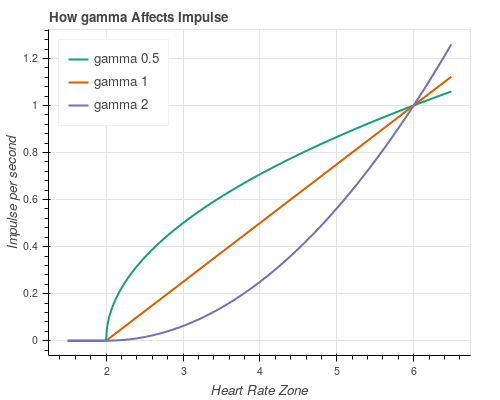
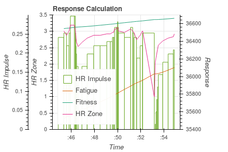

# Heart Rate Training Impulse

## Introduction

### Aims

I'm writing this article for a couple of reasons.

First, I want to explain and de-mystify the FF-Model.  I get the
impression many people don't understand quite how *simple* it is.
Following from that, maybe people aren't understanding exactly what it
shows, or how it can or should be used.

Second, I want to showcase Choochoo - a *hackable* training diary.
Choochoo is written for people at the intersection between sport and
computing / maths / science.  People who want to experiment, get their
hands dirty, and build their own, personal, customized approach.

So I'm going to show how Choochoo implements the FF-Model.  How the
calculations are made, what they mean, and how they might be tweaked.
I'll end with some questions that people might want to explore -
questions that I hope to explore using this software.

### Theory

#### Overview

Imagine it's your job to model how an athlete gets better or worse
over time.  To measure *Fitness*.  What do you do?

You know they get better if they train.  And - within reason - the
more they train the better they get.  So a good first step would be to
add up all the training.

But that's just a number that keeps getting bigger and bigger.  You
need to take into account that people get worse if they *stop*
training.  So why not decrease the number by some fixed amount (10%
say) each day they do nothing?

Congratulations!  You just invented the FF-Model.

All we need to do now is worry about the details...

#### Adding Up Training

What, exactly, do we add up?

First, we need to gauge *intensity*, so we need something you can
measure.  Power meters are the obvious example.  But there are other
options, too.  Perceived exertion (ranked on a numeric scale - there
are various standards) is not as sexy, but could work.  Heart rate is
another option.

Second, we need to measure time.  Presumably an hour's work at a given
intensity is "worth" twice as much as 30mins (but this *is* just an
assumption - maybe something we could check later).

So mutliplying intensity (however we choose to define that) by time
seems like a good candidate.  This is called Impulse.

Third, we need to decide on a weighting.  Harder workouts
automatically score more because they are more intense.  But maybe
they should score *extra*?  Maybe there's some threshold - no matter
how long you do easy work, perhaps it just doesn't count?

These are all valid questions.  Researchers simply picked some simple
answers and ran with them.

#### Exponential Decay

How, exactly, do we decrease things over time?

In the simplest case there are two options:

* We subtract a fixed amount each day (or hour, or whatever) until
  there's nothing left.

* We remove a percentage each day (this is like multiplying by a
  number smaller than 1 - multiplying by 0.9, say, is the same as
  subtracting 10%).

The second of these tends to be more common in nature and leads to a
common mathematical model..  That model is "exponential decay" (it's
the same maths as radioactivity).

I won't go into the details, but decreasing by a percentage (rather
than a fixed amount) is equivalent to having a half-life - a time over
which the initial value drops to half.  We treat fitness like
radioactive decay - after some time it will drop to half, then to half
of that (to one quarter), etc.

(In practice, instead of half-life we use a related number -
"exponential time-scale" which is about 1.4 times as long as the half
life.  But that's just a weird detail from the maths - it's not
important conceptually.)

#### Fatigue

You may have noticed a problem with our theory so far: it predicts
that the person who trains most is the fittest.  With no limit.  But
we know that's not true.  People can over-train.  People can injure
themselves if they push too hard.

How do we include this?  We need to measure *Fatigue*.

Well, we could add up the amount of training they do....  Wait,
though.  Isn't that we just said we were going to do for Fitness?  OK,
so what's the difference?  If both Fitness and Fatigue increase when
we train then what makes them different?

The difference is that Fatigue is quicker to build and quicker to fall
away.  That's easy to include in the model - we'll scale it by some
number so it grows more quickly, and we'll give it a shorter
time-scale, so it falls back down more quickly.

With this we can model "being careful" - the idea is to do enough
training that Fitness creeeps up gradually, but to avoid doing so much
that Fatigue gets dangerously high.  Train, but keep an eye on Fatigue
- it it's getting too bug, take a break.

#### Summary

So what have we got?

For both Fitness and Fatigue:

* We add up the Impulse from training.

* We decrease the numbers as time passes.

The difference between the two is that Fatigue is "more noisy" - we
add a factor so it grows more quickly when we do train, and tweak the
numbers so it decays more quickly when we don't train.

(By the way, if you hadn't guessed already, the FF in FF-Model stands
for Fitness / Fatigue.).

#### Surely There's More?

If that seems completely arbitrary, well, yeah.  But it seems to work.
People dreamt this up and then went away and tested it, and it does a
decent job.

So 

### History

### Other Software

## Survey
### History
### Arbitrary Parameters
### Current Support

https://www.trainingpeaks.com/blog/the-science-of-the-performance-manager/

Limitations.

### Heart Rate v Power

## This Work

### Choochoo

Choochoo is an free, hackable training diary, written in Python, that
runs on a wide variety of computers.  It can import FIT files, process
data with user-provided algorithms, and export results to Pandas and
Jupyter for further analysis and display.

This work extended Choochoo as follows:

* A pipeline task to calculate "HR Impulse" values from Heart Rate
  measurements during exercise.

* A pipeline task to calculate Fitness and Fatigue responses from
  these Impulses.

* A Jupyter notebook to display the results.

Pipeline tasks are Choochoo's extension mechanism for calculating new
statistics.  They integrate with internal book-keeping to re-calculate
values when new data are available, or old data are modified.

The tasks are parameterised using "constants" - parameters that
Choochoo users can modify from the command line.  These allow, for
example, the exponential decay time periods and the scaling factors in
the models to be modified.

### Impulse Calculation

The HR Impulse is calculated in three steps:

1.  Each Heart Rate measurement is converted to a HR Zone following the
    schema used by the [British Cycling
    calculator](https://www.britishcycling.org.uk/membership/article/20120925-Power-Calculator-0).
    
    The calculated zone is a floating point value, numerically equal
    to the zone number at the lower end of the zone, and linearly
    interpolated to the upper end.  So, for example, if zone 3
    extended from 130 to 150 bpm a value of 130 would be given a zone
    value of 3.0 and a value of 140 a value of 3.5.

    Values in zone 1, which has no lower boundary, are all set to 1.0
    (this does not affect the results as these are typically discarded
    when calculating the Impulse - see next step).

    Values above zone 5 are extrapolated assuming that further zones
    have the same width as zone 5.

2.  The zone value above is transformed using the expression:

        zone' = (max(zone, zero) - zero / (6 - zero)) ** gamma

    This is shown in Figure 1 (the `zero` parameter has the value 2)

    The transformation can be understood in three stages.  First,
    values below a threshold (`zero`) are discarded.  Next, the range
    to zone 6 is normalized to the range 0-1.  Finally, this
    normalized value is raised to the power `gamma`.

    The "gamma correction" is a standard technique for parameterising
    uncertainty in the shape of a function.  A value of `gamma`
    greater than 1 will give a "concave" curve - in this case implying
    that high zones are significantly more important than low zones.
    A value of `gamma` less than 1 will give a "comvex" curve -
    implying that low zones are similar in importance to high zones.

    By default, the `gamma` parameter is set to 1 and `zero` to 2.

3.  The impulse is calculated as:

        impulse = zone' * delta_t

    where `delta_t` is the time (in seconds) between this measurement
    and the next.  In a typical FIT file `delta` is around 10s; if it
    exceeds a configurable cutoff (`max_secs`, default 60s) then no
    impulse is calculated.  This avoids calculating incorrect, high
    impulses when the data feed drops.

The `gamma` and `zero` parameters allow us to encode beliefs about the
physiological processes we are modelling.  For example, if we believe
that only intensive exertion is effective, we can raise `zero` to 3 or
4.  And if we feel that all exertion above that point should be
weighted roughly equally then we can lower `gamma` to, say, 0.1,
giving a curve that approximates a "top hat" response.

### Response Calculation

The response is calculated by integrating each impulse and then
decaying with the appropriate time constant as time increases.  In
addition, an arbitrary scale factor can be applied.

By default, the time period (`tau_days`) is taken as 7 for Fatigue and
42 for Fitness.  The `scale` factor is 5 for Fatigue and 1 for Fitness
(chosen arbitrarily so that the two values cover similar ranges).

In the figure Impulses are represented by area (so the y axis is
Impulse / duration).  It is just possible to make out the increments
in the Fatigue and Fitness responses as they integrate the Impulse
data.

### Results
## Future Work
### Fitting Parameters
### Multiple Components

## Appendix - Getting Started with Choochoo

(This is all for Linux.  Something similar should work for OSX.  On
Windows it shouldn't be *too* different...)

### Install

First, you need Python 3.7 installed.  Check your version:

    > python --version
    Python 3.7.0

If necessary, you can get the latest version of Python
[here](https://www.python.org/downloads/).

Next, you need to create a "virtualenv".  This is a copy of Python
where Choochoo will be installed (so it doesn't mess with anything
else you might want to do in Python).

    > python -m venv env

Next enable that:

    > souce env/bin/activate

Your prompt should now show `(env)`.  When you see that you're using
the local copy of Python.  You will need to do this whenevr you want
to use Python and Choochoo.

With all that preparation done, we can install Choochoo:

    > pip install choochoo
    [...]
    
That should display a lot of messages but, hopefully, no errors.

Once done, you can run Choochoo:

    > ch2
	INFO: Using database at ...
	INFO: Creating tables

     Welcome to Choochoo.

     Before using the ch2 command you must configure the system.

     Please see the documentation at http://andrewcooke.github.io/choochoo

     To generate a default configuration use the command

	 ch2 default-config

     NOTE: The default configuration is only an example.  Please see the docs for
     more details.

### Configure

So create a default database:

    > ch2 default-config
    
### Load Data

Read your FIT files:

    > ch2 activities /path/to/FIT/files/*.fit

(This will take some time and, I'm afraid, might give errors.  As far
as I know. I am the only user, so if you're following these
instructions you're my first tester...  Please raise issues
[here](https://github.com/andrewcooke/choochoo/issues) if something
goes wrong.).

### Plot Data

If you've got this far, congratulations!  Now we can start Jupyter and
plot the results in your browser:

    > jupyter notebook

This should open a new page in your browser.  Select
ch2/data/notebooks and then click on TODO

## Appendix - The Author

I'm adding because I don't want to mislead.  I'm no expert on this
stuff.  The details above come from papers I've found on-line.  I
could have misunderstood.  So check things out for youself.  I've
collected some of the papers
[here](https://github.com/andrewcooke/choochoo/tree/master/data/training).

If you came here actually expecting to find something out about me,
well... way, way back in the day I got a PhD in Astronomy, but most of
my working life has been spent programming computers.  I also like to
ride my bike, when I'm not injured.
