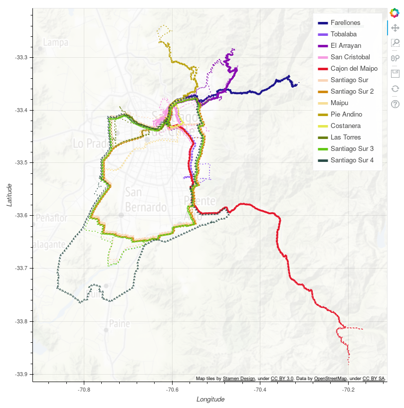
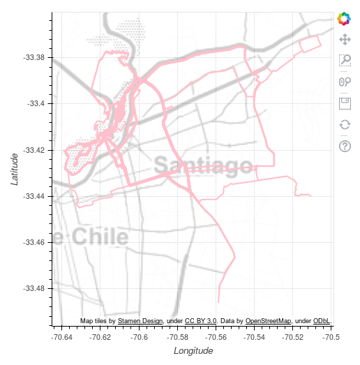
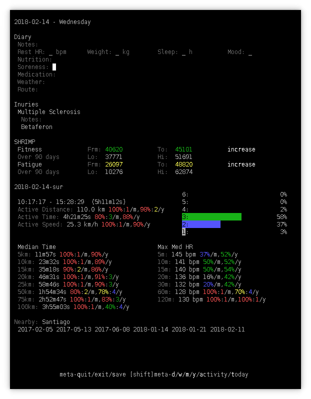

2018-12-16

# Nearby Activities

We all have favourite routes when cycling.  But even when we repeat a
ride we make small changes - ride a little further, take a short-cut
home, explore a new diversion.

This is how [Choochoo](index) identifies these related routes.

## Contents

  * [Design](#design)
    * [Data Model](#data-model)
    * [Algorithm](#algorithm)
      * [Measure Similarities](#measure-similarities)
      * [Cluster Activities](#cluster-activities)
    * [Configuration](#configuration)
      * [Pipeline](#pipeline)
      * [Constants](#constants)
  * [Results](#results)
    * [Images](#images)
    * [Diary](#diary)
  * [Appendix - DIY](#appendix---diy)

## Design

### Data Model

Two new tables are added to the database:

  * **ActivitySimilarity** is the (half-)matrix of similarity
    measurements.  For each pair of **ActivityJournal** IDs, it
    contains a float value, `similarity`, which is a measure of how
    similar the two routes were.

  * **ActivityNearby** associates similar **ActivityJournal**s into
    groups.

### Algorithm

Nearby activities are grouped in two stages:

  1. Similarities between pairs of activities are measured.
  2. Using the measured similarity, activities are grouped into
     clusters.

#### Measure Similarities

This step compares each pair of activities.  An activity can contain
tens of thousands of GPS measurements.

The solution here:

  * Is O(n log(n)).  It is faster than quadratic, even though all pairs
    are considered.
  * Is "weakly" incremental.  It is less expensive to add a new
    activity than it is to re-process all activities, but the speed
    increase is only a constant factor.
  * Is robust.  The results are not strongly influenced by noise in
    the data or processing order.

In broad outline:

  * Store points from previous activities in an [RTree](rtree).

  * For each point in a new activity:
    * Count the number of "nearby" points from other activities
      by querying the RTree,
    * Add the new points to the RTree.

  * The similarity measure for any pair of activities is the ratio of
    the number of nearby points divided by the total number of
    points in the two datasets.

Nearby points are found by extending the Minimum Bounding Rectangle
(MBR) around each point by a fixed amount (default 3m) and then
checking for MBR overlap.

The RTree returns both the matched MBR and the ActivityJournal ID
associated with the point.  The MBR is stored so that mutiple matches
are counted just once.

No account is taken of ride direction.  Segments of travel that are
ridden in both directions will "score double."

For incremental processing, points from previous activities must be
stored in the tree, but querying can be skipped.

The crude metric used (tangential plane to a sphere) means that all
calculations must be within a "small" area of latitude and longitude.
In practice this is sufficiently large for rides that start from a
single (eg home) location.  It is also possible to configure and
process multiple regions.

The similarity measure is symmetric and stored as a triangular matrix
in ActivitySimilarity.

#### Cluster Activities

The data are clustered using DBSCAN with a minimum cluster size of 3.
This is much faster than measuring similarities and is re-run
completely when needed.

The distance metric is calculated from the similarity by subtracting
the similarity from its maximum value and normalizing to 0-1.

The critical distance used to define clusters ("epsilon" in the DBSCAN
algorithm) is chosen to maximize the number of clusters.  The
value is found using an adaptive grid search.

### Configuration

#### Pipeline

Data are processed in Choochoo using an extensible *pipeline* of
tasks.  This work adds a new pipeline class, `NearbyStatistics`.

The [default configuration](getting-started#default-config) includes
one instance of this class, with parameters appropriate for Santiago,
Chile (where I live).  The next section describes how to modify these
parameters.

To add further classes (for example, to add additional groups in
separate locations), add further instances to the pipeline table in
the database.  This is best done using the `add_nearby` helper
function in
[`ch2.config.database`](https://github.com/andrewcooke/choochoo/blob/master/ch2/config/database.py).

#### Constants

The pipline task reads parameters from a JSON encoded "constant" that
can be modified by the user.  In the default configuration this is
called `Nearby.Bike`.

The current value can be displayed with:

    > ch2 constants Nearby.Bike
    Nearby.Bike: Data needed to calculate nearby activities - see Nearby enum
    1970-01-01 00:00:00+00:00: {"constraint": "Santiago", "activity_group": "Bike", "border": 3, "start": "1970", "finish": "2999", "latitude": -33.4, "longitude": -70.4, "height": 10, "width": 10}

A new value can be given using `--set --force` (force is needed
because you are overwriting an existing value).  For example:

    > ch2 constants --set --force Nearby.Bike '{"constraint": "London", "activity_group": "Bike", "border": 3, "start": "1970", "finish": "2999", "latitude": 51.5, "longitude": 0.1, "height": 10, "width": 10}'
    INFO: Using database at /home/andrew/.ch2/database.sqln
    INFO: Checking any previous values
    INFO: Need to delete 1 ConstantJournal entries
    INFO: Added value {"constraint": "London", "activity_group": "Bike", "border": 3, "start": "1970", "finish": "2999", "latitude": 51.5, "longitude": 0.1, "height": 10, "width": 10} at None for Nearby.Bike
    WARNING: You may want to (re-)calculate statistics

## Results

### Images

Images are generated using a [Jupyter
notebook](https://github.com/andrewcooke/choochoo/blob/master/notebooks/plot-groups.ipynb)
with Bokeh.

The image above shows all the groups identified in my current data.
The number of rides in each group is given in the legend.

In general the grouping makes intuitive sense, although some groups
(eg Santiago and Santiago 2) are arguably too fragmented.

The largest group (San Cristobal) is shown above (mid upper left in
the first image).  These all involve the main path through the park
(and climb) nearest my house.

Some of the routes in this park double back on themselves.  This
doubling may explain why such diverse routes are grouped together (see
comment on double-counting above).

### Diary

Within Choochoo's diary the nearby activities are listed as dates.
These are easily copied and pasted onto the command line, leading to
the appropriate diary entry.

See the near-last lines, "Nearby: Santiago".

It might be possible to convert these to "hyperlinks" using Urwid in a
later release.

## Appendix - DIY

To generate similar plots for your own rides:

  * You need FIT data from your rides.  If you use an online service
    for tracking exercise you can probably download these.  For
    example, for Garmin, go
    [here](https://www.garmin.com/en-US/account/datamanagement/).

  * [Install](getting-started) Choochoo (the default config is
    sufficient).

  * Adjust the [configuration](#constants).

  * Load your FIT data:

        > ch2 activities Bike path/to/*.fit

    (use `Run` instead of `Bike` if these are runs).

  * Start Jupyter:

        > jupyter

    which will automatically appear in your web browser.

  * Open, modify and run `notebooks/plot-group.ipynb`.  This has
    detailed configuration for my own data, but you can edit the
    script to tailor it to your own needs.

  * You don't need to use the nearby activities, of course.  You can
    plot a single activity directly.  Simply find the ActivityJournal
    ID, then load and plot the appropriate waypoints.  Have fun.
