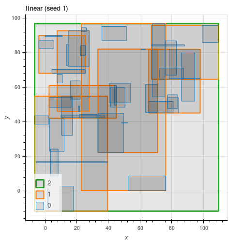
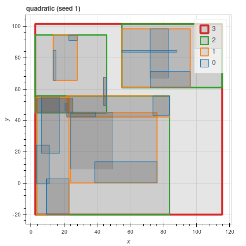
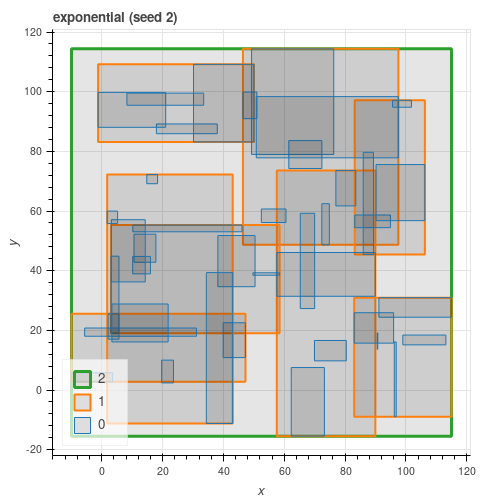

# Spatial Search

Choochoo includes a pure-Python RTree implementation ([Guttman
1984](https://github.com/andrewcooke/choochoo/blob/master/data/dev/guttman-r-trees.pdf)).

This can be used as a stand-alone library:

    from ch2.rtree import CLRTree, CQRTree, CERTree

(for Cartesian points, linear, quadratic and exponential split,
respectively).

## Contents

* [Regions](#regions)
* [Match Type](#match-type)
* [Points as Data](#points-as-data)
* [Other API Details](#other-api-details)
* [Split Algorithm](#split-algorithm)
* [Latitude / Longitude](#latitude--longitude)
* [Efficiency](#efficiency)
* [Extension](#extension)

## Regions

Internally, the tree works with "minimum bounding rectangles" (MBR) in
Cartesian coordinates:

    (x_low_left, y_low_left, x_high_right, y_high_right)

But the API takes lists of `(x, y)` points and constructs the MBR
internally.  So, for example, `add()` can be called with a single
point `[(x, y)]`, a rectange `[(x1, y1), (x2, y2)]` or a polygon
`[(x1, y1), (x2, y2), ...]`.

Since the internal representation is an MBR, returned regions (eg when
calling `get()` with `value`) are always a pair of points.

## Match Type

Queries (and deletions) can be made with four match types:
* **Equal** - the request exactly matches a value in the tree,
* **Contained** - the request is contained within a value in the tree.
* **Contains** - the request contains a value within the tree.
* **Intersects** - the request intersects a value within the tree.

In all cases, multiple results may be returned (as an iterator).
Similarly, a single deletion may remove multiple (or no) entries (the
number of deletions is returned).

## Points as Data

Since the locations may be important as *values* (as well as keys) the
MBR is returned by `get_item()`.

In this case, the `value` parameter can be used to label different
spatial datasets and given in the query:

    for point in dataset_1: tree.add(point, 1)
    for point in dataset 2: tree.add(point, 2)
    # query for dataset_1 points in the given region
    tree.get_item(region, value=1, match=MatchType.CONTAINS)
    
## Other API Details

The constructor (and `add_all()`) can take an iterable of `(points,
value)` pairs (as generated by `.items()`).

Any value can be stored.  Neither keys not values need be unique.

The Python conventions for containers are followed where possible.
Exceptions include: access returns an iterator; deletion may remove
multiple points; keys are reduced to MBRs.

Use `delete_one()` to remove only the first match found.  Match order
may change when data are added or removed.

Modifying the tree while iterating over contents is unsafe (and should
trigger an error).

## Split Algorithm

All three algorithms from the paper are implemented.  As can be seen
from the figures below, quadratic gives results close to exponential
and consistently better than linear.

## Latitude / Longitude

Basic RTree assumes Cartesian coordinates.

To provide *minimal* support for *local* latitude / longitude the
`LLRTree`, `LQRTree` and `LERTree` classes subtract the initial
longitude and normalize to (-180, 180] on input, reversing the
transform on output.

Longitude is "x", latitude "y".

With this normalization, longitude should work correctly provided data
do not cover more than half the available range.

No correction is made to latitude - this will not work correctly when
overlapping the poles.

This could also work with phase, or any other angular measure in
degrees.

## Efficiency

Profiling suggests that most time is spent comparing MBRs (evaluating
`max()` and `min()`).  This occurs on descent and argues for
relatively small nodes.  This is supported by timing tests across
different entry sizes - `max_entries` of 4 appears optimal.

## Extension

The tree was designed for further extension via mixins.  Please see
the
[code](https://github.com/andrewcooke/choochoo/blob/master/ch2/arty/tree.py).
