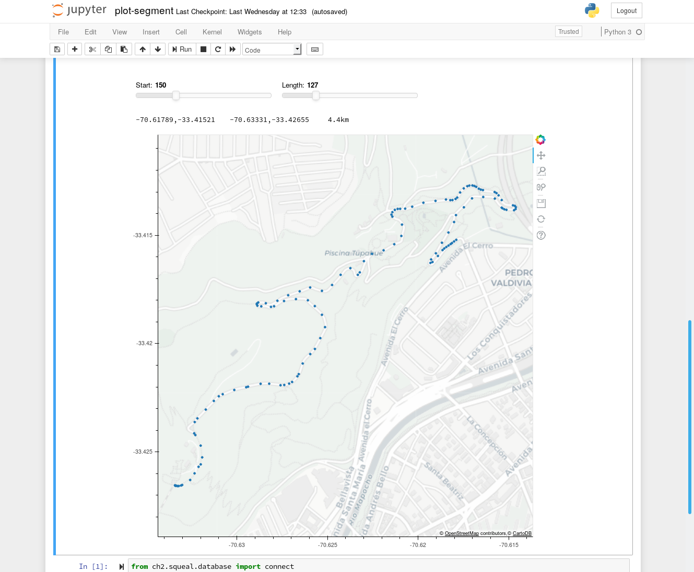
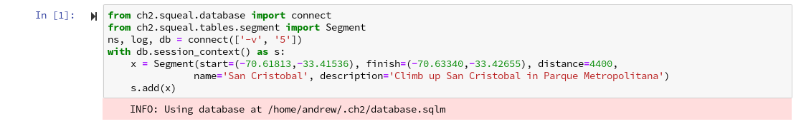
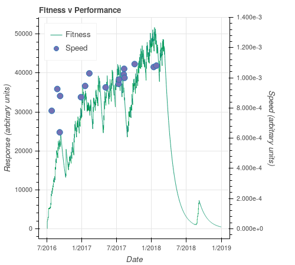

# Segments

If we are going to fit parameters in the [FF-Model](impulse.md) we
need multiple, consistent measurements.  One way of doing this is to
repeatedly ride a selected route at threshold pace.  Over time our
performance should change.

This motivates *segments* in Choochoo.  They automatically detect the
ride and generate the required statistic(s).

## Contents

* [Design](#design)
   * [Data Model](#data-model)
   * [Detection](#detection)
   * [Processing Order](#processing-order)
* [Testing](#testing)
* [Use](#use)
   * [Definition](#definition)
   * [Statistics](#statistics)
   * [Examples](#examples)

## Design

### Data Model

This work introduces two new entities in the data model: Segments and
SegmentJournals.  These follow the pattern established with Monitors,
Activities, etc:

  * Segment entries define particular segments via start and finish
    points (lat/lon) and distance (m).  They also have names,
    descriptions, and are associated with unique IDs.

  * SegmentJournal identifies *instances* of segments within
    activities.  They associate a Segment and an ActivityJournal and
    provide start and finish times that isolate the segment within the
    activity.

    This is a many-to-many relationship: an activity can contain more
    than one segment (or the same segment, repeated multiple times); a
    segment can be found in more that one activity.

    SegmentJournal is also a Source - it is a source of statistics
    (StatisticJournal entries), and those statistics will be deleted
    when the SegmentJournal entry is deleted.  Since the
    SegmentJournal itself will be deleted when either the associated
    Segment or ActivityJournal is entry is removed this guarantees
    database consistency.

Note that one advantage of this design is that SegmentJournal entries
and any associated statistics can be discarded on database upgrade
(they will be re-created when activities are re-imported).  This
supports easy upgrades while keeping the Segment definitions.

### Detection

The uncertainty and noise in GPS measurements, the sparse and uneven
sampling of GPS points, and the complex topology of possible routes
combine to make reliable segment detection difficult.

The current algorithm has two parameters, which can be set in the
pipeline configuration (all distances in m):

  * `match_bound` - the size of the region used to make an initial
    detection of activities passing near an endpoint.  Default 25m.

  * `inner_bound` - the threshold for the closest distance between
    route and endpoint for the pass to be considered to actually pass
    through the endpoint.  Default 5m.

Segment detection is implemented as follows:

  * All points in the activity are checked against an [RTree](rtree)
    containing the known segment start and finish positions to construct
    an initial list of candidates (points in the activity close to a
    segment endpoint).

  * Contiguous candidates for the same start or finish position are
    combined into a pair of coordinates (isolated candaidates are a
    duplicate).

  * Start and finish candidates are separated, and grouped by segment.

  * For each segment:

      * Possible pairs of start and finish candidates are considered:
        start candidates are considered in reverse order for the
        activity; finish candidates in normal order (this favors
        shorter times for a single segment).

      * Finish candidates earlier than start candidates are discarded.

      * Pairs of candidates not within 10% of the segment distance are
        discarded.

      * Start and finish positions are refined:

	  * The coordinate pair is expanded so that distance from the
	    end point increase in both directions.

          * Starting from the GPS point that implies the shortest
            segment, move away (ie to longer segment distances) until
            at a local minimum in distance from the endpoint (or
            moving outside `outer_bound`).

          * If this distance is within `inner_bound`, use the
            interpolated time as the refined candidate.

      * If refined start and end positions are found, add the segment
        to the database and remove the candidate points from further
        processing.

This algorithm is clearly an imperfect approximation, but appears to
give reliable results.

### Processing Order

Segments are detected on import in `SegmentImporter` which sub-classes
`ActivityImporter`.  The in-memory waypoints created when the activity
is imported are used for segment detection.  This gives faster
processing and removes complications about dependencies between
activities and segments (separate importers would need to be run
in-order).

Once consequence of this is that `ActivityImporter` as an "owner" of
statistics in the database may change to `SegmentImporter`.  Various
classes now take this name as a configuration parameter.

## Testing

Testing a previous version of the algorithm (see git archives of this
document) led to a reduction in the number of parameters.  The new,
simplified approach reproduces the results from earlier but has little
to tweak.

If `inner_bound` is decreased below 5 some routes are missed.

Increasing either parameter past the current values has little effect.

## Use

### Definition

It is possible to define a new segment using [this
notebook](https://github.com/andrewcooke/choochoo/tree/master/notebooks/plot-segment.ipynb).
Once the initial commands are altered to load for from your own
database use the sliders to isolate the segment.

The latitude, longitude and distance for the selected points are
displayed above the plot and can be copied into the code below to
create an entry in the Segment table.

### Statistics

Two statistics are current calculated by `StatisticCalculator`:

  * **Segment Time** - The time spent on the segment.  Simply the
    difference between the start and finish times found during segment
    detection.

  * **Segment Heart Rate** - The average heart rate on the segment.
    Weighted by interval to remove any possible bias from GPS
    sampling.  Values at either end of the segment are not treated
    "carefully" (no interpolation past the endpoint; possible loss of
    a value when calculating gaps).

### Examples

The statistics can be accessed in the usual ways:

    > dev/ch2 data statistic-journals 'Segment Time' 'Segment Heart Rate'
        INFO: Using database at /home/andrew/.ch2/database.sqlm
     WARNING: Missing Segment Heart Rate at 2016-12-27 10:36:39.930000+00:00 (only warning for this name)
                                      Segment Time  Segment Heart Rate
    2016-07-27 11:52:28+00:00              1280.14          146.734558
    2016-08-25 16:12:51.450000+00:00       1080.55          135.119048
    2016-09-07 10:32:20.800000+00:00       1566.20          132.219614
    2016-09-09 10:42:04.600000+00:00       1137.40          154.327160
    2016-12-27 10:36:39.930000+00:00       1147.50                 NaN
    2017-01-18 10:54:52.040000+00:00       1057.60          143.578846     
    2017-02-09 10:55:21.420000+00:00        971.88          151.478844
    2017-05-05 10:19:38.460000+00:00       1068.39          154.182160
    2017-07-12 11:52:21.520000+00:00       1042.16          145.000000
    2017-07-14 14:10:32.840000+00:00       1011.98          148.304563
    2017-08-08 12:26:04.250000+00:00        978.25          149.809939
    2017-08-10 13:59:56.190000+00:00        944.13                 NaN
    2017-08-12 11:48:34.250000+00:00       1000.70          148.204225
    2017-10-04 11:24:15.940000+00:00        917.01          150.808534
    2018-01-12 10:26:23.760000+00:00        933.77          152.388829
    2018-01-26 10:47:52.470000+00:00        925.68          153.887866

The image shows 'Segment Time' overplotted on FF-Model Fitness.
