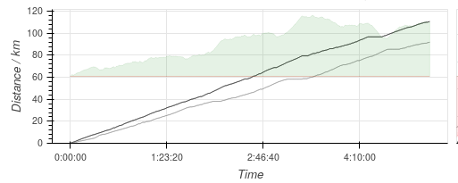
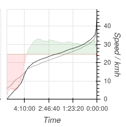

# Graphic Summary

* [Selection](#selection)
* [Manual Duplication](#manual-duplication)
* [Individual Graphics](#individual-graphics)
  * [Intensity Profile](#intensity-profile)
  * [Cumulative Intensity](#cumulative-intensity)
  * [Distance v Time](#distance-v-time)
  * [Cumulative Speed](#cumualtive-speed)
  * [Heart Rate Zones](#heart-rate-zones)
  * [Yearly Fitness / Fatigue](#yearly-fitness--fatigue)
  * [Yearly Activity](#yearly-activity)
  * [Route Map](#route-map)

## Selection

This screen is pushed to the browser from the diary.  Open the daily
diary, move to a day with an activity (`alt-A`), and then move the
cursor down to the bottom of the screen.  The left/right arrows will
select a comaprison activity (if any are similar) and pressing enter
will (after a delay while the image is generated) display the plot.

## Manual Duplication

You can duplicate / modify the plots in this display using the
notebook made during development.  Start [Jupyter](data-analysis) and
then open the `diary/poc` notebook.

## Individual Graphics

Below I will explain each graphic in turn.

### Intensity Profile

Top left is a long plot against distance that shows, in black line,
the intensity of the exercise with distance.  This is measured in the
same HR Impulse units used in the [FF-Model](impulse), so directly
(within the limits of the model) **reflects how much "fitness" you are
getting from the exercise (and how much "fatigue")**.

The grey line, if present, shows the same data for the comparison
activity and the green/red shaded area shows the difference between
the two.  Green indicates that the current actiivty was more intense;
red that the comparison was more intense.

### Cumulative Intensity

To the right of the intensity profile is a plot of cumulative
intensity.  This is the same data as the profile, but ordered by
intensity and placed on a time axis.  It shows how much time was spent
at or above a certain intensity and **makes comparisons with other
activities quick and simple**.

The grey line, if present, is the same for the comparison activity,
and the red/green shaded area shows the difference between the two.
Green indicates that the current actiivty was more intense; red that
the comparison was more intense.

### Distance v Time

Second row on the left, a long plot of distance against time.  **The
steeper the slope, the faster you are moving.**

The grey line, if present, is the same for the comparison activity,
and the red/green shaded area shows the difference between the two.
Green indicates that the current actiivty was faster; red that the
comparison was faster.

### Cumulative Speed

To the right of the distance/time plot is the cumulative speed.  This
shows how much time was spent at or above a certain speed and **makes
comparison with other activities quick and simple**.

The grey line, if present, is the same for the comparison activity,
and the red/green shaded area shows the difference between the two.
Green indicates that the current actiivty was faster; red that the
comparison was faster.

### Heart Rate Zones

To the far right of the second row is a histogram of time spend in
different heart rate zones.  **This shows the intensity of the
activity as a whole and is useful in assessing and planning
training.**

### Yearly Fitness / Fatigue

Third row on the left is a plot of log Fitness and Fatigue over the
preceding year (up to the date of the activity).  The black line is
log Fitness, the grey shading log Fatigue.

**Fitness shows how you are improving over time; Fatigue tracks the
level of shoirt-term stress on your body.  You should aim to increase
Fitness while keeping Fatigue within reasonable limits.**

For more information see the documentation on the [FF-Model](impulse).
Here log of the value is plotted so that we can show a wide range.
Note that this *compresses* the upper range and makes the curved
declines appear as straight lines.  I may change this to a linear plot
at some point.

Red circles, if shown, represent the daily rest heart rate (lowest
value in 24 hours).

### Yearly Activity

Final row on the left is a plot of activity ove the preceding year (up
to the date of the activity).  The black circles represent the time
spent in each activity.  **This shows how consistent you have been
over the year.**

A grey shaded region, if shown, is the number of daily steps.

### Route Map

Bottom right is the activity route, overlaid on a map.  HR Impulse is
marked using red shading, **indicating which parts of the activity
were most intense**.

The grey line, if present, shows the comparison activity.

