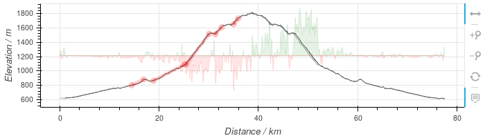
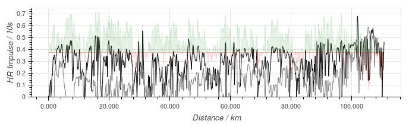
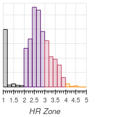
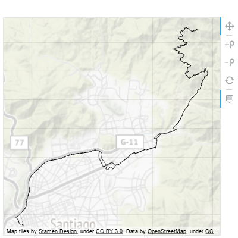
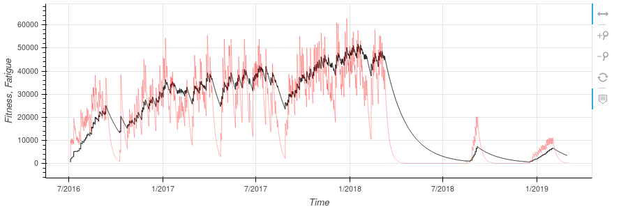
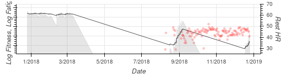
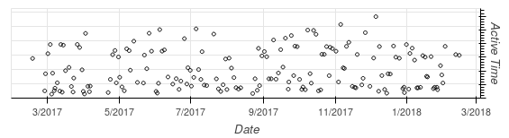
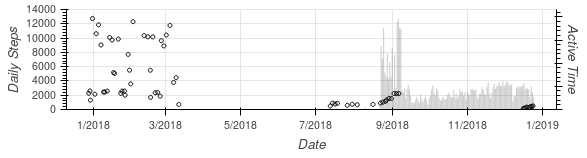

# Graphic Summary

* [Selection](#selection)
* [Individual Graphics](#individual-graphics)
  * [Elevation](#elevation)
  * [Intensity](#intensity)
  * [Cumulative Intensity](#cumulative-intensity)
  * [Power](#power)
  * [Heart Rate Zones](#heart-rate-zones)
  * [Route Map](#route-map)
  * [Fitness / Fatigue](#fitness--fatigue)
  * [Activity](#activity)

## Selection

This screen is pushed to the browser from the diary.  Open the daily
diary, move to a day with an activity (`alt-A`), and then move the
cursor down to the bottom area of the screen.  The left/right arrows
will select a comparison activity (if any are similar) and pressing
enter will start Jupyter.

Once the Jupyter page is displayed you will need to select "Run All"
from the "Cell" menu to generate the output.

## Individual Graphics

Below I will explain some of the graphics.  Hopefully the rest are
similar enough to be understood without more details.

### Elevation

This shows the profile of the ride, from left to right.  Auto-detected
climbs are added in red (details of the climbs are printed lower down
the page).  So in the example above, the ride was 40km up a mountain,
with 5 separate "climbs" and a total elevation gain of around 1000m.

If a comparison activity was selected then that ride is shown too, in
grey, and the difference between the two rides is displayed in red
(-ve) and green (+ve) across the middle of the plot.

The plot can be dragged and zoomed using the mouse and buttons at the
side of the plot.

Derivation of elevation from STRM surveys (if needed) is described
[here](elevation).

### Intensity

A plot against distance that shows, in black line, the intensity of
the exercise with distance.  This is measured in the same HR Impulse
units used in the [FF-Model](impulse), so directly (within the limits
of the model) **reflects how much "fitness" you are getting from the
exercise (and how much "fatigue")**.

The grey line, if present, shows the same data for the comparison
activity and the green/red shaded area shows the difference between
the two.  Green indicates that the current activity was more intense;
red that the comparison was more intense.

### Cumulative Intensity

To the right of the intensity profile is a plot of cumulative
intensity.  This is the same data as the profile, but ordered by
intensity and placed on a time axis.  It shows how much time was spent
at or above a certain intensity and **makes comparisons with other
activities quick and simple**.

The grey line, if present, is the same for the comparison activity,
and the red/green shaded area shows the difference between the two.
Green indicates that the current activity was more intense; red that
the comparison was more intense.

### Power

This plot shows an *estimate* of the power generated by the rider,
median smoothed over 60s and clipped to avoid -ve values.  Full
details of the calculation are explained [here](cda).

As with other plots, comparison activity data are displayed in grey,
differences in red and green.

### Heart Rate Zones

To the far right of the cadence data (last row of the longer plots) is
a histogram of time spend in different heart rate zones.  **This shows
the intensity of the activity as a whole and is useful in assessing
and planning training.**

### Route Map

This shows the route used.

The grey line, if present, shows the comparison activity.

To the right are smaller maps showing the same data as earlier, using
red shading to give an idea of where the activity was more intense,
etc.

### Fitness / Fatigue

These two plots show the same data; the lower, smaller plot uses a log
scale so that the details of declines can be seen more clearly.

The black line is Fitness, the red line Fatigue.  **Fitness shows how
you are improving over time; Fatigue tracks the level of short-term
stress on your body.  You should aim to increase Fitness while keeping
Fatigue within reasonable limits.**

For more information see the documentation on the [FF-Model](impulse).

### Activity

The first activity plot shows time (black) and distance (grey) spent
on activities.

The second activity plot shows steps and rest heart rate.
