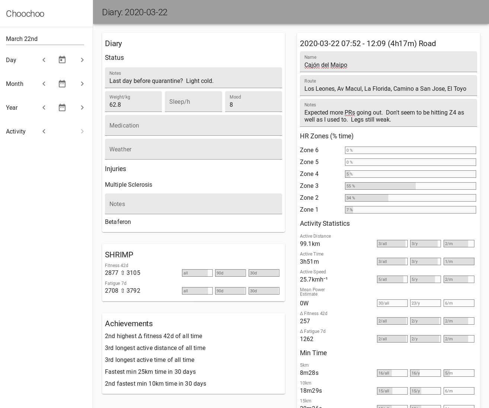
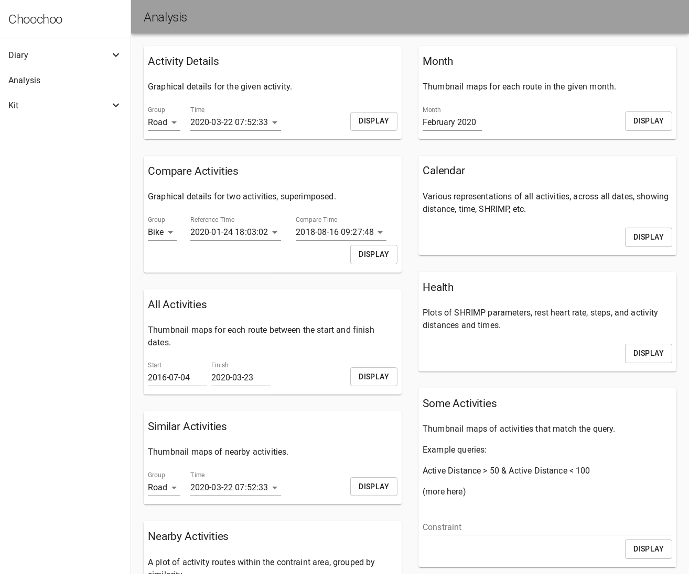
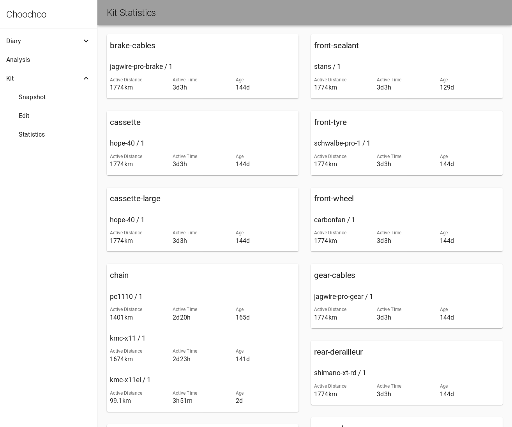

# Web Interface

* [Introduction](#introduction)
* [Screenshots](#screenshots)
  * [Diary](#diary)
  * [Analysis](#analysis)
  * [Kit](#jit)

## Introduction

For more general details on how to use Choochoo, see [Daily
Use](daily-use).  Here I will give examples from the web interface,
which provides an easier-to-use alternative to some of the basic
functionality (with more in development).

To start the web interface use the command:

    > ch2 web start

and to stop it:

    > ch2 web stop

The interface is responsive and should work fine via a phone browser.
However, do not publicly expose the web server as it gives complete
access to your computer (via Jupyter) and is not password-secured.

## Screenshots

### Diary

This shows similar data to the `ch2 diary` command, allowing the user to
enter data and step through dates.

### Analysis

Links to the different plots available via the `ch2 jupyter` command.
Selecting an option will open a plot in a new window.

### Kit

Information related to tracking kit (the `ch2 kit` command).
